## 1. Giới thiệu về đề tài

Ứng dụng này được sử dụng để hỗ trợ việc tạo và quản lý các lớp học một cách dễ dàng.
Trang web này giúp nhân viên vận hành của FA quản lý và lập lịch các lớp học, với các tính năng như sau:

- Tạo và quản lý nội dung chương trình học.
- Tạo và quản lý chương trình đào tạo.
- Lập kế hoạch và quản lý các lớp học.
- Báo cáo các lớp học theo tuần, quý.

### 1.1. Mục đích

Để cung cấp một cái nhìn tổng quan về trang web quản lý lớp học, mô tả quy trình chi tiết để tạo, bắt đầu, đóng và quản lý các lớp học bao gồm:

- Luồng business
- Tài liệu thiết kế màn hình
- Giao diện người dùng
- User story
- Các yêu cầu chức năng cụ thể cho dự án này bao gồm:
  - Xác định phạm vi mục tiêu kinh doanh, chức năng kinh doanh và các đơn vị tổ chức cần được bao gồm.
  - Xác định quy trình kinh doanh mà giải pháp phải hỗ trợ.
  - Tạo ra sự hiểu biết chung về yêu cầu chức năng cho tất cả các bên liên quan.
  - Xác định cơ sở để xác định các bài kiểm tra chấp nhận cho giải pháp nhằm xác nhận rằng những gì được cung cấp đáp ứng yêu cầu.
  - Ngoài ra, SRS cũng mô tả các yêu cầu phi chức năng, ràng buộc thiết kế và các yếu tố khác cần thiết để cung cấp một mô tả đầy đủ và toàn diện về yêu cầu cho phần mềm.

### 1.2. Phạm vi

Phạm vi của SRS này xác định các hoạt động của nhân viên vận hành của Academy trong việc quản lý và lập lịch các lớp học.

- Tạo và quản lý nội dung chương trình học.
- Tạo và quản lý chương trình đào tạo.
- Lập kế hoạch và quản lý các lớp học.
- Báo cáo các lớp học theo tuần, quý.

### 1.3. Các khái niệm chuyên môn

| Từ               | Định nghĩa                                       |
| ---------------- | ------------------------------------------------ |
| Syllabus         | Nội dung đào tạo                                 |
| Training program | Chương trình đào tạo. Được tạo từ nhiều syllabus |
| Traning class    | Lớp đào tạo. Có nhiều training program           |
| Trainer          |                                                  |
| Trainee          |                                                  |
|                  |                                                  |

### 1.x. Overview

Mục này sẽ dẫn người dùng đi đến chi tiết tổng quan để giúp người dùng nắm bắt được cách xử lý của hệ thống Academy Management nhanh chóng.

#### Feature 1: Syllabus

User Story 1: Create syllabus
User Story 2: Update syllabus

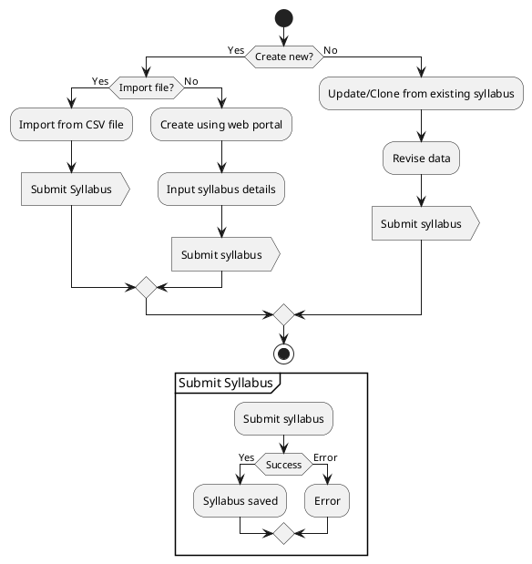

#### Feature 2: Training program

User Story 3: Create training program
User Story 4: Update training program

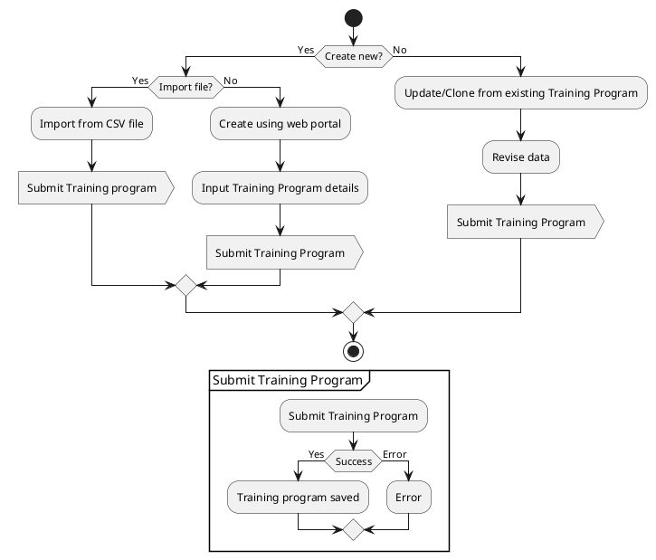

#### Feature 3: User

#### Feature 4: Training class

User Story 5: Create training class
User Story 6: Update training class

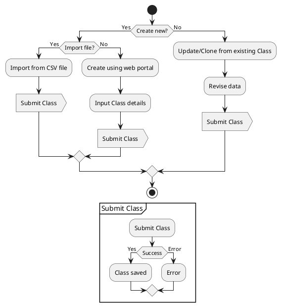

## 2. Mô tả

### 2.1. Product Perspective

Website ứng dụng quản lý kế hoạch lớp học được dùng để tạo lớp học với chương trình đào tạo có nội dung chi tiết trong thời gian cụ thể.
Quản trị viên có thể dễ dàng điều chỉnh nội dung chương trình đào tạo với nhiều đối tượng học viên khác nhau.

### 2.2. Các chức năng của sản phẩm

**Chức năng chung**:

| STT | Chức năng                     | Phạm vi phát triển                                                |
| --- | ----------------------------- | ----------------------------------------------------------------- |
| 1.  | Upload file                   | Tải lên tài liệu đào tạo                                          |
| 2.  | Tạo đối tượng                 | Tạo bao gồm chương trình học, chương trình đào tạo, lớp học       |
| 3.  | Chỉnh sửa đối tượng           | Chỉnh sửa bao gồm chương trình học, chương trình đào tạo, lớp học |
| 4.  | Xóa đối tượng                 | Xóa bao gồm chương trình học, chương trình đào tạo, lớp học       |
| 5.  | Thay đổi trạng thái đối tượng | Trạng thái chương trình học, chương trình đào tạo, lớp học        |
| 6.  | Nhập đối tượng                | Nhập danh sách chương trình học, chương trình đào tạo, lớp học    |

**Chức năng chính**:

| Tên chức năng                    | Mô tả                                                                                                                                                                                                                                                                                                          |
| -------------------------------- | -------------------------------------------------------------------------------------------------------------------------------------------------------------------------------------------------------------------------------------------------------------------------------------------------------------- |
| 1. Tạo syllabus                  | Dựa trên chủ đề đào tạo cụ thể, người dùng có thể tạo nội dung chi tiết của syllabus. syllabus là dữ liệu chính để tạo chương trình đào tạo.                                                                                                                                                                   |
| 2. Cập nhật syllabus             | Trong danh sách syllabus đã tạo, người dùng chọn syllabus muốn cập nhật, sau đó di chuyển đến màn hình với thông tin chi tiết liên quan. Vì syllabus là dữ liệu chính của chương trình đào tạo, hãy cẩn thận khi cập nhật nó, nó sẽ ảnh hưởng đến tất cả các chương trình sử dụng nó.                          |
| 3. Tạo chương trình đào tạo      | Chương trình đào tạo được tạo ra bằng cách kết hợp nhiều syllabus.                                                                                                                                                                                                                                             |
| 4. Cập nhật chương trình đào tạo | Cho phép người dùng cập nhật các chương trình đào tạo đã tạo.                                                                                                                                                                                                                                                  |
| 5. Tạo lớp học                   | Chương trình đào tạo là dữ liệu meta để tạo một lớp học. Tùy thuộc vào người học khác nhau, người dùng có thể dễ dàng chỉnh sửa nội dung đào tạo để tạo ra một lớp học khác nhau.                                                                                                                              |
| 6. Cập nhật lớp học              | Cho phép người dùng cập nhật lớp học đã tạo.                                                                                                                                                                                                                                                                   |
| 7. Chức năng lọc trong lịch      | Lọc theo ngày, khung thời gian, địa điểm lớp học, trạng thái lớp học                                                                                                                                                                                                                                           |
| 8. Phân bổ tính toán             | Tự động tính toán việc phân bổ syllabus                                                                                                                                                                                                                                                                        |
| 9. Mã lớp học                    | Tự động tạo mã dựa trên địa điểm lớp học, năm tạo, người tham dự, tên lớp học, số thứ tự lớp học. Định dạng: `HCM22_FR.O_DevOps_01` HCM: dữ liệu từ field location 22: năm hiện tại của hệ thống FR: dữ liệu từ field Program Content O: dữ liệu từ Format type 01: sequence number từ 01 to 99 |

### 2.3. Đặc điểm user

Có bốn loại người dùng sử dụng hệ thống này:

- Administrator: có toàn quyền truy cập trên bất kỳ màn hình nào.
Admin có trách nhiệm bảo trì hệ thống, tham gia sửa lỗi phần mềm, triển khai và bảo trì thường xuyên, có thể tạo giáo trình, chương trình đào tạo và lớp học.

- Class admin: có thể xem lớp đào tạo để hỗ trợ setup phòng, trang thiết bị học tập, kiểm tra tình trạng giảng viên, học viên.
- Trainer: có thể tạo giáo trình (syllabus), tạo chương trình đào tạo (class).
- Trainee: là người học. Có thể:
  - xem chương trình đào tạo cụ thể
  - truy cập và tải xuống tài liệu đào tạo để nghiên cứu.

### 2.4. Constraint hệ thống

Sau đây là các giới hạn chính:

- Maximum file upload size là `40MB`.
- Web application được hỗ trợ trên trình duyệt Chrome, Edge và Firefox.

## 3. Yêu cầu chi tiết

### 3.1. Functionality

### 3.2. Non-functional requirements

| STT | Nội dung                                                                                               | Tiêu chuẩn  | Mô tả                                       |
| --- | ------------------------------------------------------------------------------------------------------ | ----------- | ------------------------------------------- |
|     | Tốc độ truy cập website nhanh, ổn định                                                                 | Hiệu quả    |                                             |
|     | Các chức năng quản lý có UI trực quan, rõ ràng. Người dùng có thể sử dụng khi chưa được đào tạo trước. | Trực quan   |                                             |
|     | System should provide reliable and relevant search results 100% of times.                              | Hiệu quả    |                                             |
|     | maximum 8s to load a page and search a result displayed within 5s.                                     | Performance |                                             |
|     | supported to import and export files in excel, doc, pdf, and attach the other website links.           |             |                                             |
|     | Supportability This allows users with high permission to update roles and permission by themselves.    | Permission  | Ứng dụng có tính năng tùy chỉnh permission. |

### 3.3. Các yêu cầu out of scope

- Quản lý ngân sách của training class
- Tích hợp hệ thống authentication bên ngoài
- App setting

## High level design

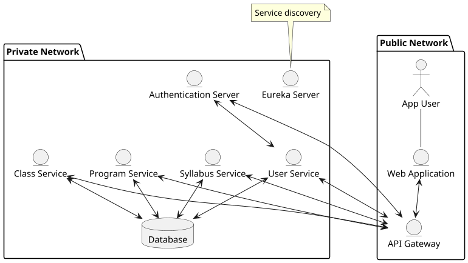

## Low level design

### Mô hình thực thể kết hợp ERD

<!-- TODO: add relationship blocks -->
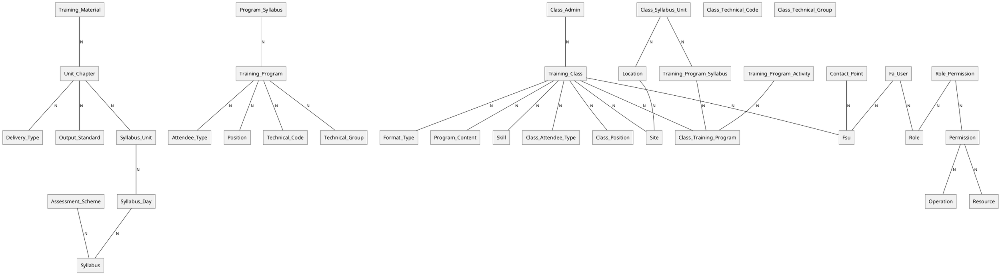

### Mô hình cơ sở dữ liệu

- **Syllabus Service**

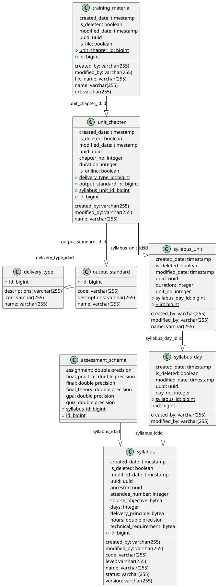

- **User service**

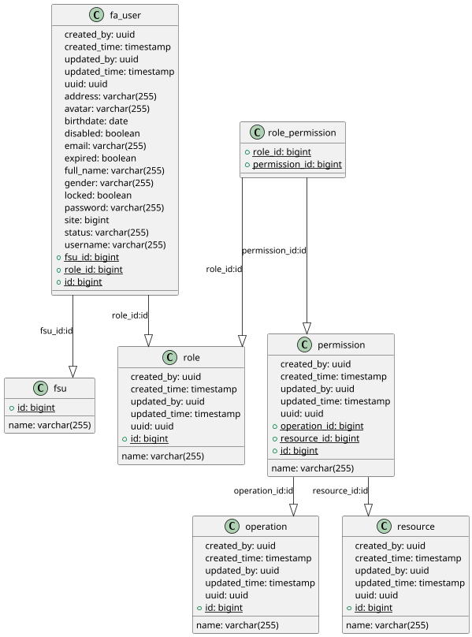

| Table Name | Column Name  | Constraint | Data Type    | Nullable | Description                                             |
| ---------- | ------------ | ---------- | ------------ | -------- | ------------------------------------------------------- |
| fa_user    | created_by   |            | uuid         |          | The UUID of the user who created the user entry.        |
|            | created_time |            | timestamp    |          | The timestamp when the entry was created.               |
|            | updated_by   |            | uuid         |          | The ID of the user who last updated the user entry.     |
|            | updated_time |            | timestamp    |          | The timestamp when the user entry was last updated.     |
|            | uuid         | Unique     | uuid         |          | The unique identifier of the user.                      |
|            | address      |            | varchar(255) |          | The address of the user.                                |
|            | avatar       |            | varchar(255) |          | The URL or path to the user's avatar image.             |
|            | birthdate    |            | date         |          | The birthdate of the user.                              |
|            | disabled     |            | boolean      |          | Indicates if the user is disabled or not.               |
|            | email        |            | varchar(255) |          | The email address of the user.                          |
|            | expired      |            | boolean      |          | Indicates if the user account has expired or not.       |
|            | full_name    |            | varchar(255) |          | The full name of the user.                              |
|            | gender       |            | varchar(255) |          | The gender of the user.                                 |
|            | locked       |            | boolean      |          | Indicates if the user account is locked or not.         |
|            | password     |            | varchar(255) |          | The hashed password of the user.                        |
|            | site         |            | bigint       |          | The ID of the site associated with the user.            |
|            | status       |            | varchar(255) |          | The status of the user account.                         |
|            | username     |            | varchar(255) |          | The username of the user.                               |
|            | fsu_id       |            | bigint       |          | The ID of the user's FSU (File Storage Unit).           |
|            | role_id      |            | bigint       |          | The ID of the role assigned to the user.                |
|            | id           | PK         | bigint       |          | The primary key of the user table.                      |
| fsu        | name         |            | varchar(255) |          | The name of the FSU (File Storage Unit).                |
|            | id           | PK         | bigint       |          | The primary key of the FSU table.                       |
| operation  | created_by   |            | uuid         |          | The ID of the user who created the operation.           |
|            | created_time |            | timestamp    |          | The timestamp when the operation was created.           |
|            | updated_by   |            | uuid         |          | The ID of the user who last updated the operation.      |
|            | updated_time |            | timestamp    |          | The timestamp when the operation was last updated.      |
|            | uuid         |            | uuid         |          | The unique identifier of the operation.                 |
|            | name         |            | varchar(255) |          | The name of the operation.                              |
|            | id           | PK         | bigint       |          | The primary key of the operation table.                 |
| permission | created_by   |            | uuid         |          | The ID of the user who created the permission.          |
|            | created_time |            | timestamp    |          | The timestamp when the permission was created.          |
|            | updated_by   |            | uuid         |          | The ID of the user who last updated the permission.     |
|            | updated_time |            | timestamp    |          | The timestamp when the permission was last updated.     |
|            | uuid         |            | uuid         |          | The unique identifier of the permission.                |
|            | name         |            | varchar(255) |          | The name of the permission.                             |
|            | operation_id |            | bigint       |          | The ID of the operation associated with the permission. |
|            | resource_id  |            | bigint       |          | The ID of the resource associated with the permission.  |
|            | id           | PPK        | bigint       |          | Auto generated ID.                                      |

- **Training program service**

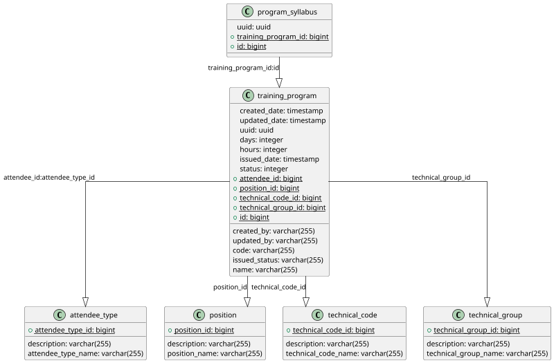

| Tên bảng         | Tên cột              | Constraint | Kiểu dữ liệu | nullable | Mô tả                       |
| ---------------- | -------------------- | ---------- | ------------ | -------- | --------------------------- |
| attendee_type    | description          |            | varchar(255) |          | Mô tả loại người tham dự    |
|                  | attendee_type_name   |            | varchar(255) |          | Tên loại người tham dự      |
|                  | attendee_type_id     | PK         | bigint       |          | ID loại người tham dự       |
| position         | description          |            | varchar(255) |          | Mô tả vị trí                |
|                  | position_name        |            | varchar(255) |          | Tên vị trí                  |
|                  | position_id          |            | bigint       |          | ID vị trí                   |
| program_syllabus | uuid                 |            | uuid         |          | UUID chương trình đào tạo   |
|                  | training_program_id  |            | bigint       |          | ID chương trình đào tạo     |
|                  | id                   | PK         | bigint       |          | ID                          |
| technical_code   | description          |            | varchar(255) |          | Mô tả mã kỹ thuật           |
|                  | technical_code_name  |            | varchar(255) |          | Tên mã kỹ thuật             |
|                  | technical_code_id    |            | bigint       |          | ID mã kỹ thuật              |
| technical_group  | description          |            | varchar(255) |          | Mô tả nhóm kỹ thuật         |
|                  | technical_group_name |            | varchar(255) |          | Tên nhóm kỹ thuật           |
|                  | technical_group_id   | PK         | bigint       |          | ID nhóm kỹ thuật            |
| training_program | created_by           |            | varchar(255) |          | UUID User tạo               |
|                  | created_date         |            | timestamp    |          | Ngày tạo                    |
|                  | updated_by           |            | varchar(255) |          | UUID User cập nhật lần cuối |
|                  | updated_date         |            | timestamp    |          | Ngày cập nhật               |
|                  | uuid                 |            | uuid         |          | UUID chương trình đào tạo   |
|                  | code                 |            | varchar(255) |          | Mã chương trình đào tạo     |
|                  | days                 |            | integer      |          | Số ngày                     |
|                  | hours                |            | integer      |          | Số giờ                      |
|                  | issued_date          |            | timestamp    |          | Ngày phát hành              |
|                  | issued_status        |            | varchar(255) |          | Trạng thái phát hành        |
|                  | name                 |            | varchar(255) |          | Tên chương trình đào tạo    |
|                  | status               |            | integer      |          | Trạng thái                  |
|                  | attendee_id          |            | bigint       |          | ID người tham dự            |
|                  | position_id          |            | bigint       |          | ID vị trí                   |
|                  | technical_code_id    |            | bigint       |          | ID mã kỹ thuật              |
|                  | technical_group_id   |            | bigint       |          | ID nhóm kỹ thuật            |
|                  | id                   | PK         | bigint       |          | Primary Key                 |

- **Class service**

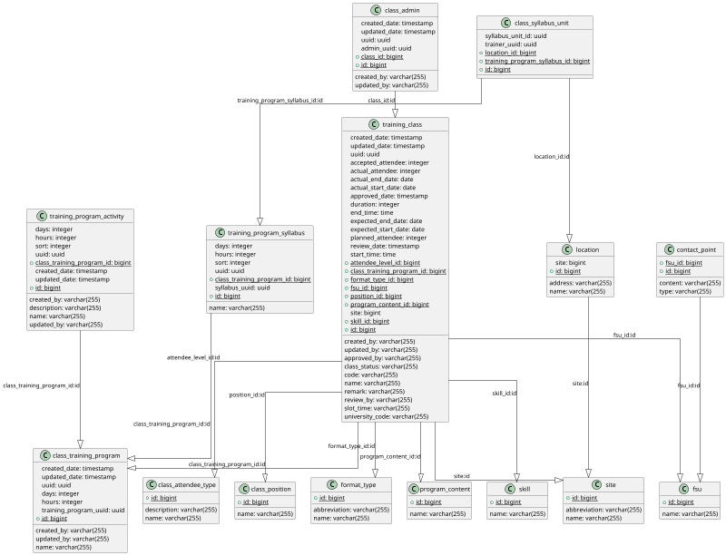

| Tên bảng               | Tên cột                      | Constraint | Kiểu dữ liệu | Nullable | Mô tả                           |
| ---------------------- | ---------------------------- | ---------- | ------------ | -------- | ------------------------------- |
| class_admin            | created_by                   |            | varchar(255) |          | UUID User tạo                   |
|                        | created_date                 |            | timestamp    |          | Ngày tạo                        |
|                        | updated_by                   |            | varchar(255) |          | UUID User cập nhật lần cuối     |
|                        | updated_date                 |            | timestamp    |          | Ngày cập nhật                   |
|                        | uuid                         |            | uuid         |          | UUID                            |
|                        | admin_uuid                   |            | uuid         |          | UUID của admin                  |
|                        | class_id                     |            | bigint       |          | ID lớp học                      |
|                        | id                           | PK         | bigint       |          | Primary Key                     |
| class_attendee_type    | description                  |            | varchar(255) |          | Mô tả loại người tham dự        |
|                        | name                         |            | varchar(255) |          | Tên loại người tham dự          |
|                        | id                           | PK         | bigint       |          | Primary Key                     |
| class_position         | name                         |            | varchar(255) |          | Tên vị trí                      |
|                        | id                           | PK         | bigint       |          | Primary Key                     |
| class_syllabus_unit    | syllabus_unit_id             |            | uuid         |          | UUID đơn vị giảng dạy           |
|                        | trainer_uuid                 |            | uuid         |          | UUID người huấn luyện           |
|                        | location_id                  |            | bigint       |          | ID địa điểm                     |
|                        | training_program_syllabus_id |            | bigint       |          | ID chương trình đào tạo         |
|                        | id                           | PK         | bigint       |          | Primary Key                     |
| class_training_program | created_by                   |            | varchar(255) |          | UUID User tạo                   |
|                        | created_date                 |            | timestamp    |          | Ngày tạo                        |
|                        | updated_by                   |            | varchar(255) |          | UUID User cập nhật lần cuối     |
|                        | updated_date                 |            | timestamp    |          | Ngày cập nhật                   |
|                        | uuid                         |            | uuid         |          | UUID                            |
|                        | days                         |            | integer      |          | Số ngày                         |
|                        | hours                        |            | integer      |          | Số giờ                          |
|                        | name                         |            | varchar(255) |          | Tên chương trình đào tạo        |
|                        | training_program_uuid        |            | uuid         |          | UUID chương trình đào tạo       |
|                        | id                           | PK         | bigint       |          | Primary Key                     |
| contact_point          | content                      |            | varchar(255) |          | Nội dung                        |
|                        | type                         |            | varchar(255) |          | Loại                            |
|                        | fsu_id                       |            | bigint       |          | ID fsu                          |
|                        | id                           | PK         | bigint       |          | Primary Key                     |
| format_type            | abbreviation                 |            | varchar(255) |          | Kiểu dạy của class              |
|                        | name                         |            | varchar(255) |          | Tên                             |
|                        | id                           | PK         | bigint       |          | Primary Key                     |
| fsu                    | name                         |            | varchar(255) |          | Tên fsu                         |
|                        | id                           | PK         | bigint       |          | Primary Key                     |
| location               | address                      |            | varchar(255) |          | Địa chỉ                         |
|                        | name                         |            | varchar(255) |          | Tên địa điểm                    |
|                        | site                         |            | bigint       |          |                                 |
|                        | id                           | PK         | bigint       |          | location ID                     |
| program_content        | name                         |            | varchar(255) |          | Tên nội dung chương trình       |
|                        | id                           | PK         | bigint       |          | Primary Key                     |
| site                   | abbreviation                 |            | varchar(255) |          | Viết tắt                        |
|                        | name                         |            | varchar(255) |          | Tên                             |
|                        | id                           | PK         | bigint       |          | Primary Key                     |
| skill                  | name                         |            | varchar(255) |          | Tên kỹ năng                     |
|                        | id                           | PK         | bigint       |          | Primary Key                     |
| training_class         | created_by                   |            | varchar(255) |          | UUID User tạo                   |
|                        | created_date                 |            | timestamp    |          | Ngày tạo                        |
|                        | updated_by                   |            | varchar(255) |          | UUID User cập nhật lần cuối     |
|                        | updated_date                 |            | timestamp    |          | Ngày cập nhật                   |
|                        | uuid                         |            | uuid         |          | UUID                            |
|                        | accepted_attendee            |            | integer      |          | Số người tham gia đã chấp nhận  |
|                        | actual_attendee              |            | integer      |          | Số người tham gia thực tế       |
|                        | actual_end_date              |            | date         |          | Ngày kết thúc thực tế           |
|                        | actual_start_date            |            | date         |          | Ngày bắt đầu thực tế            |
|                        | approved_by                  |            | varchar(255) |          | Người phê duyệt                 |
|                        | approved_date                |            | timestamp    |          | Ngày phê duyệt                  |
|                        | class_status                 |            | varchar(255) |          | Trạng thái lớp học              |
|                        | code                         |            | varchar(255) |          | Mã lớp học                      |
|                        | duration                     |            | integer      |          | Thời lượng (giờ)                |
|                        | end_time                     |            | time         |          | Thời gian kết thúc              |
|                        | expected_end_date            |            | date         |          | Ngày kết thúc dự kiến           |
|                        | expected_start_date          |            | date         |          | Ngày bắt đầu dự kiến            |
|                        | name                         |            | varchar(255) |          | Tên lớp học                     |
|                        | planned_attendee             |            | integer      |          | Số người tham gia dự kiến       |
|                        | remark                       |            | varchar(255) |          | Ghi chú                         |
|                        | review_by                    |            | varchar(255) |          | Người đánh giá                  |
|                        | review_date                  |            | timestamp    |          | Ngày đánh giá                   |
|                        | slot_time                    |            | varchar(255) |          | Thời gian mở slot               |
|                        | start_time                   |            | time         |          | Thời gian bắt đầu               |
|                        | university_code              |            | varchar(255) |          | Mã trường đại học               |
|                        | attendee_level_id            |            | bigint       |          | ID cấp độ người tham dự         |
|                        | class_training_program_id    |            | bigint       |          | ID chương trình đào tạo lớp học |
|                        | format_type_id               |            | bigint       |          |                                 |

### Đối Tượng Tham Gia Và Yêu Cầu Chức Năng

### Mô hình use case của hệ thống

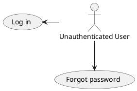

TODO

```plantuml
@startuml

package "Authenticated User" {
   actor Trainee
   actor Trainer
   actor Admin
   actor "Super Admin" as SuperAdmin
}
package Syllabus {
   usecase "Create new syllabus" as CreateNewSyllabus
   usecase "Add existing syllabus" as AddExistingSyllabus
   usecase "Delete syllabus" as DeleteSyllabus
   usecase "Update syllabus" as UpdateSyllabus
}
package "Training Program" {
   usecase "View training program" as ViewTrainingProgram
   usecase "Training program management" as TrainingProgramManagement
   usecase "Select training program" as SelectTrainingProgram
   
   usecase "Add location for unit" as AddLocationForUnit
   usecase "Update location for unit" as UpdateLocationForUnit
   usecase "Add trainer for unit" as AddTrainerForUnit
   usecase "Update trainer for unit" as UpdateTrainerForUnit
}

package Class {
   usecase "Update Class" as UpdateClass
   usecase "Create class" as CreateClass
   usecase "Import class" as ImportClass
   usecase "Delete class" as DeleteClass
   usecase "Deactivate class" as DeactivateClass
   usecase "Class management" as ClassManagement
   usecase "View class list" as ViewClassList
   usecase "Paginate class" as PaginateClass
   usecase "Filter Class" as FilterClass
   usecase "Active class" as ActiveClass
   usecase "View class detail" as ViewClassDetail
}

usecase "Download materials" as DownloadMaterials
usecase "Logout" as Logout

Trainee --> DownloadMaterials
Trainee --> ViewTrainingProgram

TrainingProgramManagement <|.. CreateNewSyllabus
TrainingProgramManagement <|.. AddExistingSyllabus
TrainingProgramManagement <|.. DeleteSyllabus
TrainingProgramManagement <|.. UpdateSyllabus
TrainingProgramManagement <|.. AddLocationForUnit
TrainingProgramManagement <|.. UpdateLocationForUnit
TrainingProgramManagement <|.. AddTrainerForUnit
TrainingProgramManagement <|.. UpdateTrainerForUnit
TrainingProgramManagement <|.. SelectTrainingProgram

Trainer --> ViewTrainingProgram
Trainer --> TrainingProgramManagement

Admin --> ClassManagement
Admin --> UpdateClass
Admin --> CreateClass

ClassManagement <|.. ImportClass
ClassManagement <|.. DeleteClass
ClassManagement <|.. DeactivateClass

Admin --> ViewClassList

ViewClassList <|.. PaginateClass
ViewClassList <|.. FilterClass
ViewClassList <|.. ActiveClass
ViewClassList <|.. ViewClassDetail

SuperAdmin --> ViewClassList

Trainee --> Logout
Trainer --> Logout
Admin --> Logout
SuperAdmin --> Logout

@enduml
```

### Đặc tả use case

#### 3.1.1. Use Case 1: Login

| Screen on Web | Platform | Function | As a user | I want to        | So that I can          | Business rule                                                                                                                                                                                                         |
| ------------- | -------- | -------- | --------- | ---------------- | ---------------------- | --------------------------------------------------------------------------------------------------------------------------------------------------------------------------------------------------------------------- |
| 1             | Web      | Login    | End user  | Login to account | Access the application | khi User nhập sai thông tin đăng nhập, hệ thống hiển thị lỗi EM01 "Invalid username or password", khi nhập thiếu trường: EM02 "Required field!"  User nhập đúng thông tin đăng nhập -> System dẫn đến trang chủ |

| No  | Screen item name                                          | Type       | Attribute | Length | Display | Input | Required | Supplementary explanation                                                                                                                                                                                                                                                    |
| --- | --------------------------------------------------------- | ---------- | --------- | ------ | ------- | ----- | -------- | ---------------------------------------------------------------------------------------------------------------------------------------------------------------------------------------------------------------------------------------------------------------------------- |
| 1   | Enter Email                                               | Textbox    | X         | Max:40 | ○       | ○     | ○        | Need to have an email domain                                                                                                                                                                                                                                                 |
| 2   | Password                                                  | Textbox    | X         | Min:12 | ○       | ○     | ○        | Hide/Unhide Password should be password of fsoft account                                                                                                                                                                                                                     |
| 3   | Sign in                                                   | Button     | -         | -      | ○       | x     | ○        | [Ev01] Process Flow: Step 1: after inserting email address and password, user clicks Login button, system returns error message (failure) or directs user to Homepage (success). False: Display error message "Invalid username or password." True: Direct user to home page |
| 4   | Forgot password?                                          | Link       | -         | -      | ○       | x     | ○        | [Ev02] Process Flow: Step 1: Click Forgot password link, system directs user to the Forgot password page to reset password                                                                                                                                                   |
| 5   | If you don't have an account, please contact <FA@fpt.com> | Label/Link | -         | -      | ○       | x     | ○        | [Ev03] Process Flow: Step 1: If user has no account, click <FA.HCM@fsoft.com.vn> link, system will open Outlook to compose a new email. Step 2: User fills in all info and send email to <FA.HCM@fsoft.com.vn> to create a new account                                       |
| 6   | Academy Training Management                               | Label      | -         | -      | ○       | x     | ○        | System name                                                                                                                                                                                                                                                                  |

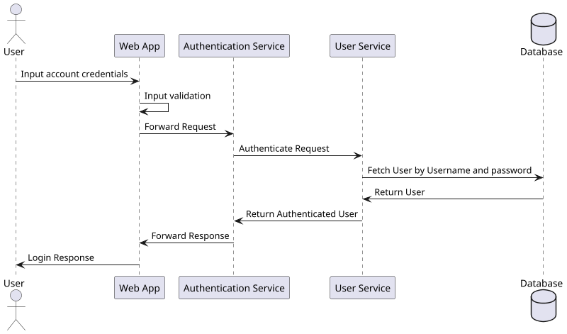

#### 3.1.2. Use Case: List Syllabus

#### 3.1.3. Use Case: Syllabus details

#### 3.1.4. Use Case: Tạo / update Syllabus

#### 3.1.5. Use case: List Training Program

#### 3.1.6. Use Case: Chi tiết Training Program

#### 3.1.7. Use case: Tạo Training Program

#### 3.1.8. Use case: List Class

#### 3.1.9. Use case: Training Class Details

#### 3.1.10. Use case: Tạo training class

#### 3.1.11. Use case: Training Calendar

#### 3.1.12. Use case: List Trainer

#### 3.1.13. Use case: Thông tin Trainer

#### 3.1.14. Use case: Thông tin Trainee

## Giao diện dành cho người dùng

### Login

