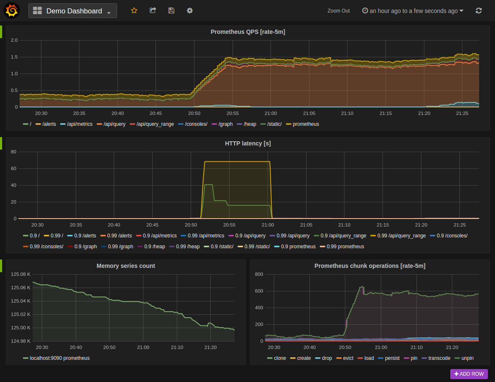
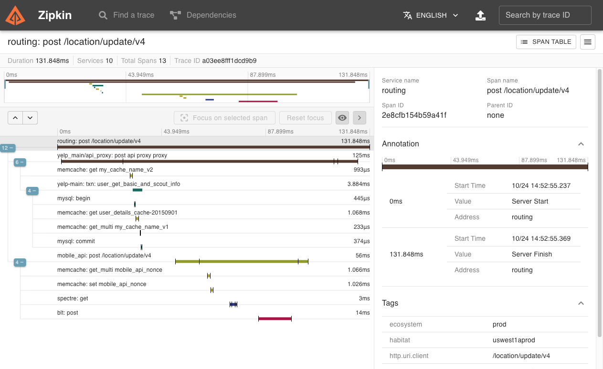

# Report

# Nội dung

Nguyễn Tân Thiên

1. Tên đơn vị TTTN: FPT Software
2. Địa chỉ đơn vị TTTN: Tòa nhà FTown 3, Lô E3, Đường Võ Chí Công, P. Long Thạnh Mỹ, TP. Thủ Đức, TPHCM
3. Nội dung TTTN (nếu có): - Tên đề tài: Hệ thống quản lý học viên Academy Management System

## Nội dung Lý thuyết

- Tìm hiểu về Restful Web Service
- Tìm hiểu về kiến trúc microservice và cách tìm cách áp dụng vào trong hệ thống
- Tìm hiểu về công nghệ container (Docker), cách sử dụng, quản lý container và giao tiếp giữa các container
- Tìm hiểu load balancer, service discovery, API gateway, giao tiếp giữa các service, circuit breaker, distributed tracing, message queue, thu thập, quản lý và hiển thị metric, logging
- Tìm hiểu Java, Spring Framework, Spring Cloud, Spring Security, Spring Data, Hibernate ORM
- Tìm hiểu các design pattern: dependency injection, singleton, factory methods

## Nội dung Thực hành

- Phân tích & thiết kế CSDL trên PostgreSQL
- Các chức năng quản lý:

  + tạo và quản lí lớp học ngắn hạn, bao gồm chương trình đào tạo và nội dung đào tạo
  + tạo và quản lí bài học và đính kèm tài liệu học
  + tạo và quản lí người dùng (bao gồm học viên và giảng viên)

- Chức năng tìm kiếm và filter cho các bài học, khóa học, lớp học và user
- Chức năng import data có sẵn từ file CSV
- Thống kê các lớp học theo tuần, quý
- Áp dụng kiến trúc microservice: 4 service độc lập thực hiện một chức năng cụ thể
  + service quản lí bài học
  + service quản lí chương trình đào tạo
  + service quản lí lớp học
  + service quản lí thông tin người dùng

- sử dụng Eureka làm service discovery để cho các component có thể xác định chính xác địa chỉ của các service khác trong hệ thống
- Tạo authentication server để handle security logic cho toàn bộ hệ thống
- Tạo API gateway để điều phối, bảo mật và quản lý communication giữa các service
- Quản lý metric của các service bằng Prometheus để theo dõi tài nguyên sử dụng, thời gian phản hồi, phát hiện sự cố, alert,... và dùng Grafana để hiển thị các thông số một cách trực quan
- Áp dụng Zipkin cho distributed tracing để theo dõi đường đi của request qua các service, giúp phân tích và hiểu rõ hơn về quá trình xử lý, tìm kiếm và debug.
- Sử dụng Docker trong quá trình develop local
- Áp dụng SOLID trong lập trình hướng đối tượng

# CHƯƠNG I: TỔNG QUAN VỀ ĐƠN VỊ THỰC TẬP

## Giới thiệu về đơn vị thực tập

Tên đơn vị: Công ty TNHH Phần mềm FPT
Tên tiếng anh: FPT Software
Tên viết tắt: FSoft
Địa chỉ: Lô T2, Đường D1, Phường Tân Phú,, TP. Thủ Đức, TP. Hồ Chí Minh

## Lịch sử hình thành và phát triển

Giai đoạn hình thành (1999 - 2005)

- 1999: FPT Software được thành lập vào ngày 13 tháng 1 năm 1999, là công ty thành viên của Tập đoàn FPT. Mục tiêu ban đầu là cung cấp các dịch vụ phần mềm và giải pháp công nghệ thông tin.
- 2002: FPT Software mở văn phòng đầu tiên tại Nhật Bản, bước đầu mở rộng thị trường ra quốc tế.
- 2003: Công ty đạt được chứng chỉ CMM Level 5, chứng chỉ cao nhất về quản lý quy trình phần mềm, đánh dấu bước tiến quan trọng trong việc đảm bảo chất lượng sản phẩm và dịch vụ.

Giai đoạn phát triển (2006 - 2015)

- 2006: FPT Software mở văn phòng tại Hoa Kỳ và Singapore, tiếp tục mở rộng thị trường ra quốc tế.
- 2008: Công ty đạt được chứng chỉ ISO 27001, chứng chỉ về quản lý an ninh thông tin.
- 2010: FPT Software trở thành công ty phần mềm đầu tiên tại Việt Nam đạt doanh thu 100 triệu USD.
- 2014: Công ty tiếp tục mở rộng thị trường với việc thành lập văn phòng tại Châu Âu và Australia.

Giai đoạn tăng trưởng mạnh mẽ (2016 - nay)

- 2016: FPT Software vượt mốc 10.000 nhân viên và tiếp tục đạt được nhiều hợp đồng lớn từ các khách hàng quốc tế.
- 2018: Công ty đạt doanh thu 400 triệu USD, và tiếp tục phát triển mạnh mẽ trong các lĩnh vực như trí tuệ nhân tạo (AI), Internet of Things (IoT), và dịch vụ đám mây.
- 2020 - nay: FPT Software tiếp tục mở rộng mạng lưới văn phòng và trung tâm phát triển tại nhiều quốc gia khác nhau, đồng thời đẩy mạnh nghiên cứu và phát triển các công nghệ tiên tiến như blockchain, big data và automation.

## Nhiệm vụ

Cung cấp dịch vụ và giải pháp công nghệ thông tin:

- Gia công phần mềm: FPT Software cung cấp dịch vụ gia công phần mềm chất lượng cao, bao gồm phát triển ứng dụng, kiểm thử phần mềm, và bảo trì hệ thống.
- Giải pháp công nghệ: Cung cấp các giải pháp công nghệ tiên tiến trong các lĩnh vực như tài chính, ngân hàng, viễn thông, y tế, và sản xuất.

Đổi mới và sáng tạo:

- Nghiên cứu và phát triển: Đầu tư mạnh mẽ vào nghiên cứu và phát triển các công nghệ mới như AI, IoT, blockchain, và big data để đáp ứng nhu cầu ngày càng cao của khách hàng.
- Đào tạo và phát triển nguồn nhân lực: FPT Software chú trọng vào việc đào tạo và phát triển nguồn nhân lực chất lượng cao, không chỉ đáp ứng nhu cầu nội bộ mà còn phục vụ cho ngành công nghiệp phần mềm toàn cầu.

Đảm bảo chất lượng và an ninh thông tin:

- Quản lý quy trình chất lượng: Áp dụng các quy trình quản lý chất lượng tiên tiến như CMMI, ISO 9001 để đảm bảo sản phẩm và dịch vụ luôn đạt tiêu chuẩn cao nhất.
- Bảo mật thông tin: Tuân thủ các tiêu chuẩn quốc tế về an ninh thông tin như ISO 27001 để bảo vệ dữ liệu của khách hàng và công ty.

Hỗ trợ và phát triển cộng đồng:

- FPT Software tham gia vào nhiều hoạt động từ thiện và phát triển cộng đồng, góp phần nâng cao chất lượng cuộc sống của người dân và phát triển xã hội.
- Tăng cường hợp tác với các đối tác quốc tế để trao đổi kinh nghiệm, công nghệ và mở rộng thị trường, đóng góp vào sự phát triển của ngành công nghệ thông tin toàn cầu.

Với lịch sử hình thành và phát triển đầy ấn tượng cùng nhiệm vụ rõ ràng, FPT Software đã và đang khẳng định vị thế của mình là một trong những công ty phần mềm hàng đầu tại Việt Nam và trên thế giới.

# Khái niệm

## RESTFul Web Service

`Restful Web Service` (còn được gọi là `RESTful API`) là một kiểu kiến trúc và giao thức được sử dụng trong việc thiết kế và xây dựng các service web.
định nghĩa các quy tắc để thiết kết các web service chú trọng vào tài nguyên hệ thống
`REST` (Representational State Transfer) là một kiến trúc phân cấp dựa trên giao thức HTTP, được sử dụng để tạo ra các service web linh hoạt, có thể mở rộng và tương tác dễ dàng.

Các đặc điểm chính của Restful Web Service bao gồm:

- RESTful Web Service sử dụng các phương thức HTTP như GET, POST, PUT, DELETE để thao tác trên các tài nguyên.
- Data được truyền qua RESTful API thường theo định dạng `JSON` (JavaScript Object Notation) hoặc `XML` (eXtensible Markup - Language).
- Thiết kế hướng tài nguyên (resource-oriented): Các RESTful API được thiết kế xung quanh các tài nguyên (resources) như đối tượng, bảng dữ liệu, hoặc một khía - cạnh cụ thể của hệ thống.
- RESTful API cho phép thực hiện CRUD (Create, Read, Update, Delete) trên tài nguyên thông qua các phương thức HTTP tương ứng.
- Stateless: Server không lưu trạng thái của client giữa các request. Mỗi request từ client phải chứa đủ thông tin để server xử lý.
- Các URL được thiết kế để dễ đọc, dễ hiểu và mô tả mục đích của tài nguyên mà nó đại diện.

## Microservice

### Load balancer

`Load Balancer` - cân bằng tải - là một thành phần quan trọng trong một hệ thống microservice để phân phối công việc giữa các instance (đối tượng) của từng service, giúp cải thiện hiệu suất, độ tin cậy và khả năng mở rộng của hệ thống.
Một số điểm quan trọng về vai trò và chức năng của load balancer:

- Phân phối tải: Load balancer nhận các request và phân phối chúng đến các instance khác nhau của một service, giúp đảm bảo rằng công việc được phân phối đồng đều và không quá tải cho bất kỳ instance nào của service.

- Điều hướng request: Load balancer có thể sử dụng các thuật toán điều hướng để quyết định instance nào của service sẽ xử lý request.
Điều này giúp tối ưu hóa việc phân phối công việc và tăng hiệu suất.
Các thuật toán phổ biến bao gồm:
  + Round Robin: Phân phối các yêu cầu đến từng instance theo lượt.
  + least connections (Ít kết nối nhất): Chuyển các yêu cầu đến instance có ít được sử dụng nhất.
  + IP hashing (băm địa chỉ IP)
  + Weighted Round Robin: Phân phối yêu cầu dựa trên trọng số được chỉ định cho từng instance, cho phép ưu tiên các instance có dung lượng cao hơn.
  + Ngẫu nhiên: Chọn ngẫu nhiên một instance để xử lý từng yêu cầu.

- Độ tin cậy: Load balancer có thể phát hiện các service không hoạt động hoặc không phản hồi và tự động loại bỏ chúng khỏi danh sách các service, đảm bảo request không được gửi đến các service không hoạt động, giúp cải thiện độ tin cậy của hệ thống.

- Load balancer cho phép các service có thể mở rộng ngang (horizontal scaling) bằng cách thêm các instance mới của service đó.
Khi có nhiều instance của service, load balancer có thể phân phối request đến chúng để tăng khả năng xử lý và hiệu suất tổng thể của hệ thống.

- `SSL termination`: Một số load balancer có chức năng SSL termination - giải mã request trước khi gửi đến service và và mã hóa lại khi response về cho user.
Điều này giảm tải xử lý SSL trên các service và cung cấp hiệu suất tốt hơn.

Một số công cụ phổ biến để triển khai một load balancer trong môi trường microservice bao gồm `Nginx`, `HAProxy`, các cloud service như `Amazon Elastic Load Balancer` (ELB) hoặc `Google Cloud Load Balancer`.

### Service Discovery

### Failover

Failover (dự phòng) là quá trình tự động chuyển giao từ một hệ thống chính đến một hệ thống dự phòng khi hệ thống chính gặp sự cố.
Mục tiêu của failover là đảm bảo tính sẵn sàng và liên tục của hệ thống, giảm thiểu thời gian gián đoạn và duy trì hoạt động mà không gây ảnh hưởng đến người dùng.

Quá trình failover bao gồm các bước sau:

- Giám sát: theo dõi và giám sát liên tục sức khỏe của hệ thống.
Nếu sự cố xảy ra, quá trình failover được khởi động.

- Đảm bảo hệ thống dự phòng: Hệ thống dự phòng phải được chuẩn bị sẵn sàng từ trước, việc triển khai một máy chủ dự phòng, một hệ thống máy chủ hoặc một môi trường cloud dự phòng rất quan trọng.

- Chuyển giao: Các service và tài nguyên từ hệ thống chính được chuyển đến hệ thống dự phòng.
Quá trình này có thể bao gồm chuyển đổi tải và định tuyến lưu lượng, sao lưu và phục hồi dữ liệu, cập nhật cấu hình và khởi động lại các ứng dụng.

- Kiểm tra và xác nhận: Hệ thống dự phòng được kiểm tra để đảm bảo rằng nó hoạt động chính xác và có thể xử lý request.
Khi hoàn tất quá trình failover, các service sễ được test để xác nhận là đang hoạt động theo yêu cầu.

Failover có thể được triển khai cho các thành phần khác nhau của một hệ thống, bao gồm máy chủ, cơ sở dữ liệu, mạng, ứng dụng và service.
Đóng vai trò quan trọng trong việc đảm bảo tính sẵn sàng và ổn định của hệ thống, đồng thời giảm thiểu tác động của sự cố lên trải nghiệm người dùng và thất thoát trong hoạt động kinh doanh.

### Caching

Caching là một kỹ thuật được sử dụng để lưu trữ và tái sử dụng dữ liệu đã được truy vấn trước đó, giúp cải thiện hiệu suất và giảm tải cho các microservice bằng cách giảm số lượng truy vấn đến tài nguyên (database/service,...) và giảm thời gian truy cập dữ liệu.

Cách mà caching có thể được áp dụng trong microservice phần lớn thường là cache kết quả truy vấn API/database khi một service truy vấn dữ liệu từ một tài nguyên khác.
Khi có các truy vấn tương tự, service có thể trả về kết quả từ cache mà không cần thực hiện lại truy vấn đến tài nguyên đó, giúp giảm độ trễ và tải cho tài nguyên được truy vấn.

Caching trong thiết kế microservice cần được quản lý cẩn thận để đảm bảo tính nhất quán và đồng bộ hóa dữ liệu.
Các công nghệ và công cụ như `Redis`, `Memcached` và `Hazelcast` thường được sử dụng để triển khai nhiều instance của server để cache phân tán.

#### Cache expiration và invalidation

Sau một thời gian, dữ liệu trong cache chắc chắn sẽ khác so với dữ liệu gốc. Điều này có thể dẫn đến bất tiện cho người dùng, hoặc lỗi và hỏng dữ liệu.
Có 2 loại chính để loại bỏ các data cũ trong cache:

- `Time-base expiration` TTL` - time to live: Thêm một trường thời gian cho data được thêm vào cache.
Khi truy vấn, cache sẽ kiểm tra TTL của dữ liệu.
Nếu thời gian đã hết, cache sẽ xóa dữ liệu và truy vấn lại nguồn dữ liệu để cập nhật cache và TTL mới.
Toàn bộ quá trình được gọi là `cache eviction`.
Việc đưa ra giá trị phù hợp cho TTL có thể là một vấn đề.
Khi TTL ở giá trị quá cao, cache sẽ thường giữ dữ liệu cũ và nếu TTL quá ngắn, cache sẽ xóa các mục khỏi cache nhanh hơn mức cần thiết.

- `Change-based expiration`: cache data được update hoặc loại bỏ dựa trên thay đổi trong nguồn dữ liệu.
Mỗi khi có thay đổi, cache data sẽ bị xóa để đảm bảo dữ liệu mới nhất được truy xuất từ nguồn dữ liệu chính.

### Một số cách áp dụng cache


- `Cache aside`: ứng dụng sẽ query cache để lấy data, nếu không có trong cache (cache miss) thì ứng dụng sẽ query vào tài nguyên và update cache.
Phù hợp cho nghiệp vụ có khối lượng read nhiều và việc cần dữ liệu luôn mới nhất có thể không được ưu tiên.
Nếu cache server bị fail thì application vẫn có thể lấy dữ liệu từ database để sử dụng.

- `Read through cache`: application chỉ cần giao tiếp với cache.
Còn cache sẽ tự lấy dữ liệu ở chính nó hoặc xuống database lấy dữ liệu.
Trong trường hợp này, cache chính là database chính của ứng dụng, nó đóng vai trò rất rất quan trọng.
Nếu cache không hoạt động thì application sẽ chết.

- `Write-through`: cập nhật dữ liệu trong cache trước rồi mới cập nhật source.

- `Write-back`: cache không lưu dữ liệu xuống source ngay khi nhận request từ application mà sẽ đồng bộ dữ liệu xuống source định kì theo thời gian, hoặc theo số lượng dữ liệu được insert/update.
Thích hợp cho các hệ thống write-heavy, giảm được chi phí và áp lực lên database.
Nếu cache bị chết, có thể bị mất vĩnh viễn data mà cache chưa kịp đồng bộ.

- `Stale-while-revalidate`: được sử dụng trong các trình duyệt web và CDN để cung cấp nội dung trong cache trong khi nội dung đó đang được cập nhật ở background.
Khi có truy vấn, bản sao được lưu trong cache sẽ được trả về ngay lập tức và một asynchronous request ở background sẽ được gửi đến máy chủ gốc để nhận bản sao mới nhất và cập nhật cache.
Người dùng luôn được cung cấp nội dung nhanh chóng nhờ kỹ thuật này, ngay cả khi phiên bản được lưu trong cache hơi lỗi thời.
Cách này có thể dẫn đến việc user nhận được dữ liệu cũ trong một khoảng thời gian ngắn.

- `Refresh-ahead`: dùng cronjob để truy vấn bản mới nhất của các mục được lưu trong cache một cách định kỳ.
Đây là một cách để tránh độ trễ tăng đột biến khi một mục cache nóng (được truy cập nhiều) bị xóa.
Điểm yếu là nếu dữ liệu không thay đổi thường xuyên thì sẽ thực hiện nhiều request dư thừa.

## Thiết kế hệ thống microservice

### Ngôn ngữ lập trình

Việc chọn ngôn ngữ lập trình tốt nhất để sử dụng và phát triển một hệ thống microservice phụ thuộc vào mức độ quen thuộc của đội phát triển phần mềm với ngôn ngữ đó, các thư viện có sẵn cho các tính năng và bộ tính năng mà mỗi ngôn ngữ cung cấp.
Chọn đúng ngôn ngữ từ ban đầu sẽ tiết kiệm rất nhiều thời gian và công sức khi phát triển sản phẩm.

Theo khảo sát của JetBrains năm 2021 về microservice, 3 ngôn ngữ phổ biến nhất được dùng trong lập trình microservice là `Java` (41%), `JavaScript` (37%) và `Python` (25%).
Mỗi ngôn ngữ lập trình này đều có lịch sử lâu đời, nhiều developer và doanh nghiệp sử dụng, online support, môi trường runtime,...
e.g. `Node.JS` và lượng thư viện lớn để phát triển nhiều tính năng.

Còn phải đảm bảo ngôn ngữ phù hợp với nghiệp vụ kinh doanh hiện tại; chẳng hạn như `Python` rất phổ biến trong data analysis (phân tích thông tin), `JavaScript` là một lựa chọn phù hợp trong fullstack development, thiết kế back-end và front-end bằng một ngôn ngữ, e.g. `MERN` stack gồm bốn công nghệ JavaScript được thiết kế để hoạt động cùng nhau: `MongoDB`, cơ sở dữ liệu `NoSQL`; `Express`, một framework back-end; `React` thư viện JavaScript để xây dựng web UI; và `Node`.

### Cơ sở dữ liệu

Khi chọn một cơ sở dữ liệu phù hợp để sử dụng với các ứng dụng bạn xây dựng cho kiến ​​trúc microservice, hãy luôn đặt khả năng mở rộng, availability và bảo mật lên hàng đầu.
Chọn cơ sở dữ liệu hỗ trợ tốt nhất cho mô hình dữ liệu mà bạn dự định sử dụng trong microservice của mình. Nhóm công nghệ của bạn phải mở rộng quy mô để xử lý mọi tải ứng dụng, đảm bảo tính khả dụng với các giao thức chuyển đổi dự phòng và bảo mật ứng dụng khỏi mọi cuộc tấn công độc hại.

Khi chọn một cơ sở dữ liệu cho microservice, có nhiều yếu tố cần xem xét, bao gồm tính nhất quán dữ liệu, hiệu suất, khả năng mở rộng, độ tin cậy và công cụ hỗ trợ.
Dưới đây là một số cơ sở dữ liệu phổ biến thường được sử dụng trong môi trường microservice:

- Cơ sở dữ liệu quan hệ (Relational Database): Các cơ sở dữ liệu quan hệ như `MySQL`, `PostgreSQL` và `Oracle Database` thường được sử dụng cho microservice.
Chúng cung cấp tính nhất quán dữ liệu, khả năng truy vấn mạnh mẽ và công cụ quản lý.
Tuy nhiên, việc mở rộng quy mô lớn có thể gặp khó khăn và hiệu suất có thể bị hạn chế trong môi trường có tải lớn.

- Cơ sở dữ liệu không quan hệ (NoSQL Database): Các cơ sở dữ liệu không quan hệ như `MongoDB`, `Cassandra` và `Redis` thường được sử dụng trong microservice.
Chúng cung cấp khả năng mở rộng tốt, hiệu suất cao và hỗ trợ tốt cho việc lưu trữ và truy vấn dữ liệu không cấu trúc.
Tuy nhiên, tính nhất quán dữ liệu có thể yếu hơn so với cơ sở dữ liệu quan hệ.

- Cơ sở dữ liệu cột (Columnar Database): Các cơ sở dữ liệu cột như `Apache Cassandra` và `Amazon Redshift` có thể phù hợp cho một số microservice đòi hỏi tính mở rộng và xử lý lượng dữ liệu lớn. Columnar database thường được sử dụng cho việc phân tích dữ liệu.

- Cơ sở dữ liệu key-value: Các cơ sở dữ liệu key-value như `Redis` và `Amazon DynamoDB` cung cấp hiệu suất cao và khả năng mở rộng tốt.
Thích hợp cho các trường hợp sử dụng đơn giản như lưu trữ cache và quản lý session.

- Cơ sở dữ liệu đồ thị (graph database): Các cơ sở dữ liệu đồ thị như `Neo4j` và `Amazon Neptune` thường được sử dụng cho microservice có tính tương tác mạnh với dữ liệu theo kiểu đồ thị.
Cơ sở dữ liệu đồ thị có mục đích duy nhất để tạo và thao tác trên đồ thị.
Đồ thị chứa các node, cạnh (edge) và properties, tất cả đều được sử dụng để biểu diễn và lưu trữ dữ liệu theo cách mà cơ sở dữ liệu quan hệ khó có thể thực hiện.

Khi chọn cơ sở dữ liệu cho microservice, nên xem xét yêu cầu cụ thể của từng service, tính nhất quán dữ liệu, hiệu suất, khả năng mở rộng và quản lý dữ liệu. Thường thì hệ thống microservice có thể sử dụng nhiều cơ sở dữ liệu khác nhau tùy thuộc vào yêu cầu và tính chất của từng service.

### Communication

Khi chọn phương pháp giao tiếp cho microservice, có nhiều yếu tố cần xem xét, bao gồm tính nhất quán, hiệu suất, độ linh hoạt và khả năng mở rộng.
Dưới đây là một số phương pháp giao tiếp phổ biến được sử dụng trong môi trường microservice:

- HTTP/RESTful API: Giao tiếp thông qua giao thức HTTP và sử dụng RESTful API là một phương pháp giao tiếp phổ biến cho microservice.
Đơn giản, dễ sử dụng, cho phép truy cập các service thông qua các phương thức HTTP như GET, POST, PUT và DELETE, cho phép sự tương tác linh hoạt giữa các service và có rất nhiều ngôn ngữ hỗ trợ.

- Messaging: Giao tiếp thông qua messaging là một phương pháp phổ biến cho microservice, đặc biệt là trong các tình huống xử lý asynchronous (bất đồng bộ) và event-driven (hướng sự kiện).
Các hệ thống message queue như `RabbitMQ`, `Apache Kafka` và `ActiveMQ` cung cấp khả năng chuyển tiếp tin nhắn giữa các service, cho phép xử lý bất đồng bộ qua mô hình `publish-subscribe`.

- RPC (Remote Procedure Call): là một phương pháp giao tiếp cho phép gọi các phương thức từ xa giữa các service.
Các framework như `gRPC`, `Apache Thrift` và `Apache Avro` cung cấp cơ chế RPC cho việc giao tiếp giữa các service.
RPC cung cấp hiệu suất cao và tính nhất quán, nhưng đòi hỏi một định nghĩa giao thức cụ thể.

- Event-Driven: Các microservice có thể giao tiếp theo hướng `event-driven`, trong đó các sự kiện được gửi và xử lý bởi các service.
Các công cụ như `Apache Kafka`, `Apache Pulsar` và AWS `SNS`/`SQS` hỗ trợ kiến trúc event-driven và cho phép các service phát và tiêu thụ các sự kiện.

- GraphQL: GraphQL là một ngôn ngữ truy vấn dữ liệu linh hoạt cho phép client yêu cầu các trường dữ liệu cụ thể từ các service.
GraphQL cho phép client chỉ yêu cầu và nhận về dữ liệu mà nó cần, giúp giảm bớt việc truyền tải dữ liệu không cần thiết.

Khi chọn phương pháp giao tiếp cho microservice, cần xem xét yêu cầu cụ thể của hệ thống, tính nhất quán dữ liệu, hiệu suất, khả năng mở rộng và khả năng hỗ trợ của công nghệ được chọn.
Một hệ thống microservice có thể sử dụng nhiều phương pháp giao tiếp khác nhau tùy thuộc vào tính chất và yêu cầu của từng service.

### Giám sát hệ thống trong microservice

Giám sát (monitoring) là việc theo dõi và thu thập thông tin về các thành phần và hoạt động trong hệ thống.
Với sự phân tán và độ phức tạp của kiến trúc microservice, việc giám sát là cực kỳ quan trọng để đảm bảo tính sẵn sàng, hiệu suất và tin cậy của hệ thống.
Mỗi team trong hệ thống microservice phải chịu trách nhiệm giám sát hiệu suất ứng dụng riêng của họ.

- Thu thập và theo dõi các chỉ số (Metrics): Giám sát microservice bao gồm việc thu thập và phân tích các chỉ số liên quan đến hiệu suất của service, chẳng hạn như - thời gian phản hồi, tỷ lệ lỗi, tải trọng, tài nguyên đang sử dụng, và số lượng request.
Các chỉ số này cung cấp thông tin về tình trạng và hành vi của từng service.

- Theo dõi phân tán (Distributed Tracing): cho phép theo dõi quá trình data di chuyển qua các microservice trong một request hoặc giao dịch.
Giúp xác định và phân tích các vấn đề liên quan đến hiệu suất và sự cố trong quá trình giao tiếp giữa các thành phần trong microservice.

- Sự kiện và nhật ký (Event and Log Monitoring): Giám sát log từ các microservice giúp ghi lại các hoạt động quan trọng và xác định các vấn đề hoặc hành vi bất thường.
Phân tích các sự kiện trong log có thể tìm hiểu được nguyên nhân gốc rễ của các vấn đề và đưa ra các biện pháp khắc phục.

- Theo dõi sự phát triển và triển khai (Deployment Monitoring): Giám sát quá trình triển khai và sự phát triển của microservice giúp bạn đảm bảo rằng các phiên bản - mới được triển khai một cách thành công và không gây ra những tác động tiêu cực đến hệ thống.

- Cảnh báo (Alerting): Thiết lập hệ thống cảnh báo cho phép nhận được thông báo tức thì khi có vấn đề xảy ra hoặc khi các chỉ số vượt ngưỡng cho phép.
Điều này giúp phản ứng nhanh chóng và giảm thiểu thời gian downtime và tác động đến người dùng.

- Ngoài việc giám sát các thành phần microservice, ta cũng cần giám sát cơ sở hạ tầng và các service liên quan khác như cơ sở dữ liệu, máy chủ, mạng, và các service mà hệ thống microservice phụ thuộc.

Việc giám sát microservice rất có lợi cho việc nhận ra các vấn đề sớm hơn và đưa ra biện pháp khắc phục để đảm bảo tính sẵn sàng, hiệu suất và độ tin cậy của hệ thống.

Giám sát là việc thu thập và phân tích dữ liệu để phát hiện các vấn đề hoặc sự bất thường trong hệ thống hoặc ứng dụng.
Dữ liệu này đến từ số liệu, nhật ký và cảnh báo, đồng thời tập trung vào những thứ cụ thể có thể được theo dõi theo thời gian.

Observability (khả năng quan sát) là một khái niệm mở rộng hơn so với monitoring.
Nó tập trung vào việc hiểu rõ hệ thống và khả năng khám phá thông tin mới từ bên ngoài.
Observability không chỉ giám sát các chỉ số và sự kiện, mà còn cho phép xem xét dữ liệu và phân tích mối quan hệ giữa các thành phần và hiểu được cách hệ thống hoạt động trong thời gian thực.
Bao gồm việc thu thập dữ liệu từ nhiều nguồn khác nhau như logs, traces, và metrics, và sử dụng các công cụ và kỹ thuật phân tích để tạo ra cái nhìn toàn diện về hệ thống.

## Các công nghệ/công cụ

### Docker


Docker là một nền tảng mã nguồn mở cho việc tạo, triển khai và chạy các ứng dụng trong `container`, một môi trường ảo hóa gọn nhẹ.
Docker cho phép đóng gói ứng dụng và tất cả các dependency của ứng dụng đó (thư viện và các tài nguyên hệ thống) vào một container duy nhất bằng công nghệ containerization để tạo ra các container tách biệt và cô lập.

`Container` là một đơn vị độc lập mà có thể chạy trên bất kỳ máy tính hoặc máy chủ nào đã cài đặt Docker mà người dùng không cần lo lắng về sự khác biệt về môi trường và cấu hình.
Mỗi container chứa tất cả những gì cần thiết để chạy một ứng dụng, bao gồm mã nguồn, thư viện, biến môi trường, các cấu hình,...

Docker đã trở thành một công cụ quan trọng trong việc triển khai ứng dụng và quản lý hạ tầng trong các môi trường phát triển phần mềm hiện đại.

Một số lợi ích của Docker bao gồm:

- Đóng gói ứng dụng: Docker cho phép đóng gói ứng dụng và tất cả các phụ thuộc của nó vào một container duy nhất, giúp đơn giản hóa quá trình triển khai và chia sẻ ứng dụng.

- Độc lập và cô lập: Mỗi container chạy độc lập và cô lập với các container khác và máy chủ host, đảm bảo tính ổn định và an toàn.

- Di động và mở rộng: Các container có thể được tải về triển khai lên bất kỳ môi trường nào đã cài đặt Docker, từ máy tính cá nhân đến môi trường cloud.

- Hiệu suất và tài nguyên: Docker sử dụng công nghệ virtualization gọn nhẹ, giúp tiết kiệm tài nguyên hệ thống và cung cấp hiệu suất tốt hơn so với các giải pháp VM (virtual machine) truyền thống.

- Docker có một hệ sinh thái phong phú với rất nhiều image và công cụ hỗ trợ, giúp quản lý và triển khai các ứng dụng trong môi trường container dễ dàng hơn.

Docker đã trở thành một công cụ quan trọng trong việc triển khai ứng dụng và quản lý hạ tầng trong các môi trường phát triển phần mềm hiện đại.

#### Docker compose


`Docker Compose` là một công cụ được sử dụng để tạo và quản lý các ứng dụng đa container.
Compose cho phép xác định cấu trúc ứng dụng trong một file `YAML` và sau đó sử dụng Docker Compose để chạy và quản lý toàn bộ hệ thống của các container liên quan.

Với Docker Compose, người dùng có thể định nghĩa các service mà ứng dụng cần, bao gồm các cấu hình như Docker image, cổng kết nối, biến môi trường, quản lí volume (data storage của container), cấu trúc mạng,...
Bằng cách sử dụng Docker Compose, người dùng có thể tạo và quản lý nhanh chóng các môi trường phát triển phần mềm, kiểm thử và triển khai của ứng dụng mà không cần phải thao tác thủ công với các command riêng lẻ.

Docker Compose có thể được sử dụng trên mọi môi trường như development, testing, production, CI (Continuous Integration),...

Các command để quản lý toàn bộ vòng đời của ứng dụng:

- Khởi tạo, dừng, build, push image của các service
- Xem trạng thái các service đang chạy
- Quản lí log của các service đang chạy
- Chạy command trên các service

Lợi ích khi sử dụng Docker Compose:

- cho phép quản lý các ứng dụng nhiều container trong một file `YAML` duy nhất, giúp đơn giản hóa nhiệm vụ phức tạp trong việc sắp xếp và điều phối các dịch vụ khác nhau, giúp quản lý và tái tạo môi trường ứng dụng dễ dàng hơn.

- Cộng tác hiệu quả: file Docker Compose rất dễ chia sẻ, tạo điều kiện cộng tác giữa các developer, đội ngũ dev-ops,... giúp quy trình làm việc hiệu quả, trôi chảy hơn, giải quyết vấn đề nhanh hơn.

- Dễ dàng cấu hình cho nhiều môi trường: có thể sử dụng variable trong file Compose để tùy chỉnh configuration cho các môi trường khác nhau hoặc những người dùng khác nhau.

- Docker Compose có cộng đồng sử dụng lớn, có nhiều tài nguyên, hướng dẫn và hỗ trợ, góp phần cải thiện Compose và giúp người dùng khắc phục sự cố một cách hiệu quả.

#### Docker networking

Docker networking bao gồm các cơ chế và chức năng được Docker cung cấp để kết nối các container với nhau và giữa container với network bên ngoài.

Docker cung cấp các tùy chọn mạng khác nhau cho phép các container giao tiếp với nhau, chia sẻ tài nguyên và tương tác với máy chủ host và các mạng bên ngoài.

Dưới đây là một số network driver trong Docker:

- Bridge Network: Chế độ mạng mặc định.
Mạng bridge sử dụng cầu nối phần mềm cho phép các container được kết nối với cùng một mạng bridge giao tiếp với nhau và đồng thời cách ly với các container không thuộc mạng bridge đó.
Docker tự động cài đặt các rule trong máy host để các container trên các mạng bridge khác nhau không thể giao tiếp trực tiếp với nhau.
Các container trên cùng mạng bridge có thể giao tiếp với nhau bằng cách sử dụng địa chỉ IP tương ứng.

- Host network: các container sử dụng không gian mạng trong network của Docker host.
Ở chế độ này, network giữa container và host không bị cô lập nữa và container sử dụng trực tiếp stack mạng của host.
Thường được sử dụng để tối ưu hóa hiệu suất do nó không yêu cầu dịch địa chỉ mạng (NAT) và không có "user-land proxy" nào được tạo cho mỗi cổng.
Cho phép container có cùng cấu hình mạng như máy chủ host và truy cập vào các dịch vụ trên mạng của máy chủ.

- Overlay network: cung cấp tính năng `Swarm` cho phép container trên nhiều Docker host giao tiếp với nhau.
Khi sử dụng overlay network thì sẽ không cần route trên hệ điều hành.

- Macvlan network: tạo ra các container với địa chỉ MAC khác nhau như một host thật.

- IPvlan: như `Macvlan` nhưng chỉ cung cấp địa chỉ IP riêng.

### Eureka

Eureka là một công cụ được phát triển ở Netflix, chủ yếu được sử dụng trong hệ thống cloud cho khám phá service, cân bằng tải và failover.
Eureka đóng một vai trò quan trọng trong cơ sở hạ tầng của Netflix.


Các chức năng chính:

- Service Registration: Mỗi service trong hệ thống microservice (`Eureka client`) sẽ đăng ký thông tin của mình với `Eureka server`, bao gồm tên service, địa chỉ IP và cổng của service, metadata và các thông số khác liên quan.
Khi một service được triển khai hoặc khởi động, nó sẽ gửi yêu cầu đăng ký tới Eureka server để thông báo rằng nó đã sẵn sàng và có thể được tìm kiếm.

- Service Discovery: các service trong hệ thống microservice có thể tìm kiếm và liên kết với nhau thông qua `Eureka server`.
Khi một service muốn tìm kiếm một service khác, nó gửi request với tên của service cần tìm tới `Eureka server`.
Eureka server có một danh sách các service đã đăng ký và có thể trả về địa chỉ IP và cổng của các instance của service cần tìm.
Service yêu cầu có thể sử dụng thông tin trả về để truy cập và giao tiếp với service mà nó cần giao tiếp.

- Cập nhật và giám sát:
Eureka server có một bản sao local chứa thông tin các service đăng ký.
Các instance của service sẽ gửi yêu cầu cập nhật định kỳ để thông báo về trạng thái hoạt động.
Nếu một instance của service không cập nhật trong một khoảng thời gian nhất định, Eureka server sẽ coi instance đó không hoạt động và loại bỏ instance/service đó khỏi danh sách.
Eureka server cũng cung cấp giao diện điều khiển web để giám sát trạng thái và thông tin về các service đã đăng ký.

- Cân bằng tải (Load Balancing): Eureka server có khả năng cung cấp thông tin về nhiều instance của cùng một service.
Service yêu cầu có thể sử dụng thông tin này để triển khai cơ chế cân bằng tải khi gửi yêu cầu tới các instance của service cần tìm.

Qua đó, Netflix Eureka giúp các service trong môi trường microservice tìm kiếm và liên kết với nhau một cách tự động và linh hoạt.
Nó giúp đảm bảo tính nhất quán và khả năng mở rộng của việc tìm kiếm và giao tiếp giữa các service trong hệ thống, các service có thể dễ dàng scale nhiều instance hoặc terminate bớt instance mà không làm ảnh hưởng đến các service phụ thuộc.

`Spring Cloud Netflix`: một project của `Spring` tích hợp `Netflix OSS` cho cấu hình tự động cho các ứng dụng `Spring Boot`.
Giúp developer có thể nhanh chóng tích hợp và config ứng dụng Spring và xây dựng các hệ thống phân tán lớn như Netflix đã sử dụng trong thực tế.
Bao gồm `Eureka` (service discovery), `Hystrix` (circuit breaker), `Zuul` (Định tuyến) và `Ribbon` (cân bằng tải).

### Prometheus


`Prometheus` là một công cụ mã nguồn mở được phát triển tại SoundCloud, có chức năng chính là giám sát hệ thống và cảnh báo.
Được thiết kế để giám sát các hệ thống phân tán và linh hoạt, làm cho nó trở thành một lựa chọn phổ biến cho việc giám sát hệ thống microservice.

thu thập số liệu từ các tài nguyên, như ứng dụng, service, hạ tầng được trong khoảng thời gian nhất định, theo các biểu thức, hiển thị kết quả và có thể kích hoạt cảnh báo khi thỏa mãn điều kiện cụ thể.

Các đặc điểm quan trọng của Prometheus bao gồm:

- Mô hình dữ liệu: Prometheus sử dụng một mô hình dữ liệu đa chiều để tổ chức và lưu trữ các chỉ số. Mỗi chỉ số bao gồm tên và một tập hợp các cặp khóa-giá trị được gọi là nhãn, cho phép truy vấn và lọc dữ liệu một cách linh hoạt.
- Thu thập chỉ số: Prometheus hỗ trợ các cơ chế thu thập chỉ số khác nhau, bao gồm các bộ chuyển tiếp (exporters), đây là các thành phần cụ thể cho phép tiết lộ chỉ số theo định dạng mà Prometheus có thể thu thập. Ngoài ra, Prometheus cung cấp các thư viện client cho các ngôn ngữ lập trình khác nhau, giúp dễ dàng thực hiện việc gắn thiết bị vào ứng dụng và tiết lộ chỉ số tùy chỉnh.
- Truy vấn và cảnh báo: Prometheus cung cấp một ngôn ngữ truy vấn mạnh mẽ gọi là PromQL (Prometheus Query Language) để thực hiện truy vấn và phân tích dữ liệu. Nó cũng tích hợp chức năng cảnh báo, cho phép định nghĩa các quy tắc cảnh báo dựa trên các điều kiện và ngưỡng chỉ số, và gửi thông báo khi các trạng thái hoặc sự kiện không mong muốn xảy ra.

Prometheus cung cấp sự linh hoạt để giám sát và cảnh báo trong môi trường microservice, giúp người dùng theo dõi và quản lý hiệu suất và tính sẵn sàng của hệ thống hiệu quả hơn.

### Grafana


`Grafana` là một công cụ mã nguồn mở để trực quan hóa dữ liệu và tạo dashboard cho các hệ thống giám sát.
Grafana cung cấp giao diện đơn giản và linh hoạt để tạo biểu đồ, đồ thị và dashboard cho việc hiển thị dữ liệu giám sát.

Các chức năng và đặc điểm chính của Grafana bao gồm:

- Trực quan hóa dữ liệu: Grafana cho phép tạo ra các biểu đồ và đồ thị linh hoạt từ các nguồn dữ liệu khác nhau, tùy chỉnh kiểu biểu đồ, định dạng màu sắc để hiển thị dữ liệu rõ ràng và trực quan.
- Tích hợp với nhiều nguồn dữ liệu: Grafana hỗ trợ tích hợp với nhiều nguồn dữ liệu khác nhau như `Prometheus`, các NoSQL/SQL database, `Elasticsearch`, `Jira`, `ServiceNow`, `GitLab`,... và nhiều hệ thống giám sát khác.
- Tùy chỉnh và chia sẻ dashboard: Grafana cho phép tùy chỉnh và thiết kế các dashboard theo ý muốn, ví dụ như các thành phần như biểu đồ, đồ thị, table, báo cáo và hình ảnh.
Có thể chia sẻ dashboard này với đồng nghiệp hoặc khách hàng.
- Cảnh báo và thông báo: Grafana cung cấp tính năng cảnh báo, cho phép người dùng tạo rules, quy tắc cảnh báo nếu các điều kiện và ngưỡng dữ liệu vượt mức cho phép.
Khi các điều kiện cảnh báo được kích hoạt, Grafana có thể gửi thông báo qua nhiều phương thức như email, tin nhắn SMS, `Microsoft Teams`, `Slack`,... và các kênh thông báo khác.



### Zipkin

`Zipkin` là một hệ thống mã nguồn mở được sử dụng để giám sát và ghi lại đường đi của các request qua các service trong hệ thống phân tán, giúp người dùng có thể theo dõi và phân tích thông tin về thời gian trễ và hiệu suất của các thành phần trong hệ thống.

Zipkin hoạt động bằng cách gửi `trace packets` (các gói tin theo dõi) qua các service trong quá trình xử lý request.
Mỗi trace packet bao gồm thông tin về request, thời gian bắt đầu và kết thúc, cũng như các thông tin khác như dữ liệu người dùng và metadata.
Các gói tin này được thu thập và lưu trữ trong cơ sở dữ liệu để xử lí và phân tích về sau, mặc định lưu trong memory.

Zipkin cung cấp một web UI để người dùng theo dõi các thông tin và phân tích dữ liệu.
Bằng cách sử dụng giao diện này, người dùng có thể theo dõi đường đi của một request qua các service, xác định thời gian trễ và tìm hiểu các vấn đề hiệu suất trong hệ thống.

Dữ liệu được tóm tắt chẳng hạn như phần trăm thời gian service xử lí một request và việc xử lí có thất bại hay không.



Zipkin web UI hiển thị sơ đồ phụ thuộc cho biết có bao nhiêu request được theo dõi đã đi qua mỗi ứng dụng.


Zipkin hỗ trợ nhiều ngôn ngữ lập trình và tích hợp với các framework phổ biến như `Spring Boot`, `MicroProfile`,...
Có thể tích hợp với các công cụ giám sát và quản lý khác như `Elasticsearch`, `Prometheus` và `Grafana`,...

Với khả năng theo dõi và phân tích dữ liệu phân tán, Zipkin là một công cụ phổ biến trong việc giám sát và tối ưu hóa hiệu suất của các mô hình service phân tán như microservice.

### PostgreSQL


PostgreSQL là một hệ thống cơ sở dữ liệu quan hệ (relational database management system - RDBMS) với hơn 35 năm phát triển đã tạo được danh tiếng về độ tin cậy, tính năng và hiệu suất.

Do `PostgreSQL` có mã nguồn mở nên có cộng đồng developer rộng lớn và hệ sinh thái cung cấp các bộ tính năng quan trọng mà thường chỉ có ở các sản phẩm độc quyền như như những tính năng của cơ sở dữ liệu không gian địa lý (geospatial), temporal database (lưu dữ liệu thời gian) hoặc các tính năng được lấy cảm hứng từ các sản phẩm cơ sở dữ liệu khác.
Ngoài ra còn có nhiều third-party cung cấp các tính năng khác chẳng hạn như cải tiến GUI - giao diện người dùng, hoặc công cụ cân bằng tải,...

Các điểm quan trọng:

- PostgreSQL được thiết kế để quản lý cơ sở dữ liệu quan hệ, với khả năng lưu trữ và truy xuất dữ liệu dưới dạng các bảng, hàng và cột.
Hỗ trợ ngôn ngữ truy vấn `SQL` và cung cấp các tính năng như khóa ngoại, transaction, view, stored procedure, trigger...

- các tính năng đảm bảo độ tin cậy cao và khả năng phục hồi sau sự cố như write-ahead logging để đảm bảo dữ liệu không bị mất trong trường hợp database failure, các công cụ sao lưu và phục hồi dữ liệu để khôi phục dữ liệu khi cần.

- Khả năng mở rộng: PostgreSQL hỗ trợ khả năng mở rộng theo cả chiều ngang (horizontal scaling) và chiều dọc (vertical scaling), cho phép phân chia dữ liệu thành các bảng phụ (`partitioning`), sử dụng các cụm (`cluster`) và `replica` để tăng hiệu suất và khả năng chịu tải.
Các công nghệ được phát triển dựa trên PostgreSQL như `PostgreSQL XL` và `Citus` cung cấp các tính năng cần thiết cho workload của hệ quản trị cơ sở dữ liệu quan hệ phân tán để mở rộng quy mô và hiệu suất hơn nữa.

- PostgreSQL có hệ thống bảo mật mạnh mẽ, bao gồm chứng thực người dùng, quyền truy cập, mã hóa dữ liệu và kiểm tra toàn vẹn. cung cấp các cơ chế bảo mật linh hoạt như phân quyền dựa trên vai trò (role-based access control) và mã hóa dữ liệu.

- PostgreSQL hỗ trợ nhiều ngôn ngữ lập trình, bao gồm `Python`, `Java`, `C/C++`, `PHP`,... cho phép phát triển các ứng dụng đa nền tảng và  dễ dàng tích hợp với các công nghệ khác.

### Java


Java là một ngôn ngữ object-oriented programming - `OOP` (lập trình hướng đối tượng), class-based, general-purpose cho phép developer viết code một lần, chạy ở mọi nơi (write once, run everywhere) - code Java khi đã biên dịch có thể chạy trên tất cả các nền tảng hỗ trợ Java mà không cần phải biên dịch lại.
Các ứng dụng Java thường được biên dịch thành `bytecode` có thể được chạy trên bất kỳ máy ảo Java (JVM) trên hầu hết các kiến trúc máy tính.
Cú pháp của Java tương tự như `C` và `C++`, rất quen thuộc đối với các lập trình viên hệ thống.
Java runtime cung cấp các tính năng dynamic (chẳng hạn như `reflection`, chỉnh sửa và update code khi ứng dụng Java đang chạy) thường không có trong các ngôn ngữ biên dịch truyền thống.
Java là một trong những ngôn ngữ lập trình phổ biến nhất được sử dụng để phát triển các ứng dụng mô hình `client-server`.

Tính đến tháng 3 năm 2024, Java 22 là phiên bản mới nhất.
Java 8, 11, 17 và 21 là các phiên bản LTS (Long Term Support) trước đây mà vẫn nhận được các bản fix bug/security chính thức.

#### JVM

Java Virtual Machine (JVM) là thành phần đóng vai trò quan trọng trong việc chạy các ứng dụng Java.

JVM là một máy ảo cho phép máy tính chạy các chương trình Java cũng như các chương trình được viết bằng các ngôn ngữ khác mà có thể được biên dịch sang Java bytecode, đảm bảo khả năng "Viết một lần, chạy ở mọi nơi" (Write Once, Run Anywhere).

Mục đích của JVM là giúp người dùng có thể chạy các ứng dụng Java trên nhiều hệ điều hành và phần cứng khác nhau mà không cần phải biên dịch lại mã nguồn.
Điều này được thực hiện bằng:

- Code Java được biên dịch thành bytecode, một dạng code không phụ thuộc vào nền tảng hệ điều hành.
JVM chịu trách nhiệm chạy bytecode này trên các nền tảng khác nhau như Windows, macOS, Linux,...

- Thông dịch bytecode: Khi chạy chương trình Java, JVM sẽ đọc và thực thi từng dòng bytecode.
JVM cung cấp một môi trường mô phỏng một máy tính vật lý, cho phép quản lý bộ nhớ, xử lý luồng và xử lý lỗi, để xử lý bytecode chi tiết cho từng nền tảng cụ thể, cho phép cùng bytecode thực thi nhất quán trên các hệ thống khác nhau.

- Ngoài việc đọc bytecode, JVM còn sử dụng các kỹ thuật biên dịch JIT (Just-in-Time).
JVM phân tích bytecode và xác định các phần code được thực thi thường xuyên và tự động biên dịch các đoạn code này thành machine code để tối ưu hóa hiệu suất.
Sự kết hợp giữa thông dịch (interpret) và biên dịch (compile) giúp cải thiện tốc độ thực thi của các chương trình Java.

- Java cung cấp một bộ thư viện và API tiêu chuẩn trong JDK (Java Development Kit).
Các API này trừu tượng hóa các chi tiết riêng cho từng hệ điều hành, cung cấp giao diện nhất quán để developer tương tác với các tài nguyên hệ thống theo cách khác nhau, như I/O, mạng, đồ họa,...
Bằng cách dựa vào các API tiêu chuẩn, các chương trình Java có thể truy cập tài nguyên hệ thống theo cách riêng của từng hệ điều hành.

- Tính di động: Vì JVM trừu tượng hóa phần cứng và hệ điều hành nên bytecode Java có thể được thực thi trên bất kỳ hệ thống nào mà JVM hỗ trợ, giúp loại bỏ việc phải viết code riêng cho từng nền tảng, giảm đáng kể nỗ lực phát triển và bảo trì, cho phép các ứng dụng Java chạy trên nhiều nền tảng mà không yêu cầu sửa đổi nhiều.

Việc tìm hiểu về cấu trúc, cách hoạt động và vai trò trong việc chạy ứng dụng của JVM giúp lập trình viên có thể tận dụng tối đa khả năng của nền tảng Java, giải quyết các vấn đề liên quan đến bộ nhớ và tối ưu hóa hiệu năng.

Các thành phần chính của JVM:

- Class loader: có chức năng đọc các file `.class` chứa bytecode và chuyển chúng thành các đối tượng class trong bộ nhớ heap của JVM.
- Runtime data area: vùng bộ nhớ được JVM sử dụng để lưu trữ dữ liệu khi thực thi chương trình.
Gồm method area, heap, stack, program counter
- Execution Engine: thành phần thực thi mã bytecode trong JVM, gồm `Interpreter`, `JIT compiler` và `Garbage Collector`

Một số JVM phổ biến: `HotSpot`, `Eclipse OpenJ9`, `GraalVM`.

### Javascript


JavaScript là một ngôn ngữ lập trình client-side phổ biến trong lĩnh vực phát triển web.
Được tạo ra ban đầu để cung cấp khả năng tương tác trực tiếp trên các trình duyệt web, JavaScript ngày nay đã phát triển thành một ngôn ngữ đa năng và mạnh mẽ, có thể sử dụng để phát triển ứng dụng web, ứng dụng di động, và cả ứng dụng máy tính.

Các browser có một JavaScript engine chuyên dụng để thực thi Javascript, như `V8` của Chrome, `SpiderMonkey` của Firefox,...
Engine phổ biến nhất để dùng trong backend là `Node.js`.

Một số đặc điểm và khả năng chính của JavaScript:

- Cú pháp dễ đọc và dễ học: JavaScript có cú pháp được lấy cảm hứng từ ngôn ngữ lập trình Java, và có các cú pháp đơn giản và dễ hiểu làm cho việc học và sử dụng JavaScript trở nên dễ dàng.

- Cải thiện giao diện người dùng: Javascript có thể tương tác với Document Object Model (DOM) của trang web, chọn phần tử HTML, thay đổi nội dung, thêm/xóa CSS,...

- giảm tải cho máy chủ ví dụ như chạy các tính toán trên client, xác minh dữ liệu trước khi gửi request lỗi tới server,...

- Giao tiếp mạng: JavaScript cung cấp các API để thực hiện các request qua mạng, như tải dữ liệu từ máy chủ thông qua `AJAX`, gửi yêu cầu HTTP, thực hiện giao tiếp WebSocket, cho phép bạn tạo ra các ứng dụng tương tác với dữ liệu từ các nguồn khác nhau.

- Hỗ trợ đa nền tảng: JavaScript là ngôn ngữ chạy phía client và được hỗ trợ trên hầu hết các trình duyệt web hiện đại mà không cần thay đổi nhiều.

JavaScript là một ngôn ngữ lập trình mạnh mẽ và linh hoạt, cho phép tạo ra các ứng dụng web động.
Nó là một phần quan trọng trong việc phát triển web hiện đại và cung cấp nền tảng để thực hiện các chức năng client-side trên web browser.

#### jQuery


jQuery là một thư viện JavaScript được thiết kế để đơn giản hóa việc thao tác trên cây DOM HTML, xử lý event, hoạt ảnh CSS và Ajax.

Tính tới 2024, có khoảng 90% các website sử dụng jQuery.

Các lợi ích chính:

- Tiết kiệm thời gian và công sức: jQuery cung cấp một cú pháp ngắn gọn và dễ đọc để lập trình JavaScript, giúp giảm bớt code và tối ưu quá trình phát triển web, giúp tiết kiệm thời gian và công sức so với việc viết JavaScript.

- jQuery cung cấp các phương thức và hàm tiện ích để tương tác với Document Object Model (DOM) một cách dễ dàng.
Bạn có thể chọn phần tử, thay đổi nội dung, thêm/xóa CSS, xử lý sự kiện và thực hiện các thao tác DOM một cách đơn giản.

- jQuery cung cấp cú pháp dễ sử dụng để xử lý event trên trang web, có thể gắn các hàm xử lý sự kiện vào các phần tử HTML một cách dễ dàng và điều chỉnh hành vi của trang web khi user tương tác.

- Tương thích trên nhiều trình duyệt: jQuery giúp giảm bớt sự khác biệt và đảm bảo tương thích trên nhiều trình duyệt khác nhau.
Nó xử lý các vấn đề tương thích một cách tự động, giúp bạn tập trung vào việc phát triển chức năng chính của ứng dụng mà không phải lo lắng về khả năng tương thích của trình duyệt.

- jQuery có cộng đồng sôi nổi luôn phát triển các plugin tiện ích cho nhiều mục đích khác nhau để mở rộng chức năng của trang web, chẳng hạn như hiệu ứng, định vị, custom component như table, thanh cuộn carousel, input, lịch,...

- Hiệu suất tối ưu: jQuery được tối ưu hóa để đạt hiệu suất tốt trên các trình duyệt web phổ biến. Nó giúp giảm thiểu việc tải xuống và xử lý DOM, cải thiện thời gian phản hồi của trang web và tăng trải nghiệm người dùng.

Tuy nhiên trong thời gian gần đây, với sự phát triển của JavaScript và các framework hiện đại, vai trò của jQuery đã giảm đi và được thay thế bởi các công nghệ mới mạnh mẽ hơn như `React` hoặc `Angular`.

### Spring Framework


#### Spring Boot

#### Spring Security

#### Spring Data

Các module chính:

- Spring Data JDBC: support cơ chế JDBC truyền thống
- Spring Data R2DBC (Reactive Relational Database Connectivity): support connect với database bằng cơ chế `Reactive` (asynchronous)
- Spring Data JPA: support cho JPA (Java Persistence API)

`Spring Data JPA` là một phần của Spring Framework được sử dụng để tương tác với cơ sở dữ liệu bằng cách cung cấp một lớp trừu tượng hoá (abstraction layer) trên JPA (Java Persistence API), giúp giảm bớt công việc lập trình và cung cấp các tính năng mạnh mẽ để làm việc với cơ sở dữ liệu trong ứng dụng Java.

Một số điểm quan trọng về Spring Data JPA:

- Spring Data JPA tương thích hoàn toàn với JPA, một chuẩn API cho quản lý đối tượng và truy xuất dữ liệu trong cơ sở dữ liệu quan hệ.
Cung cấp các công cụ và tiện ích cho việc xử lý object, truy vấn dữ liệu và quản lý mối quan hệ giữa các object.

- Giảm lặp code: Spring Data JPA cho phép định nghĩa các class kết nối với database đơn giản mà không cần viết SQL, sử dụng tên method và các quy tắc đặt tên để tự động tạo các câu SQL truy vấn dữ liệu, giảm thiểu lặp code và giúp tập trung vào việc thao tác với dữ liệu.

- Tự động tạo câu truy vấn SQL: Spring Data JPA cung cấp các phương thức trừu tượng cho các hoạt động cơ bản như lưu, cập nhật, xóa và truy vấn.

- Cho phép làm việc với nhiều database khác nhau như `MySQL`, `PostgreSQL`, `Oracle`, `SQL Server`,... và có thể cấu hình và chuyển đổi nguồn dữ liệu một cách dễ dàng mà không cần thay đổi code.

- Tích hợp với các tính năng Spring khác trong Spring Framework như `dependency injection`, `transaction management` và `caching` giúp xây dựng ứng dụng nhanh chóng và hiệu suất hơn.

#### Spring Cache

Spring Cache là một tính năng trong Spring Framework nhằm hỗ trợ việc caching (bộ nhớ cache) trong ứng dụng Java. Nó giúp tăng hiệu suất của ứng dụng bằng cách lưu trữ dữ liệu tạm thời trong bộ nhớ cache, giảm thiểu việc truy xuất dữ liệu từ nguồn dữ liệu chính (database, API, hoặc bất kỳ nguồn dữ liệu nào khác) trong các lần truy vấn tiếp theo.

Spring Cache cung cấp một cách dễ dàng để đánh dấu các phương thức trong các bean Spring là các phương thức có khả năng caching. Khi phương thức được gọi, Spring sẽ kiểm tra bộ nhớ cache xem dữ liệu đã được lưu trữ trong cache hay chưa. Nếu có, dữ liệu sẽ được trả về từ cache mà không cần thực hiện lại phương thức. Nếu không, phương thức sẽ được thực thi và kết quả sẽ được lưu trữ trong cache để sử dụng cho các lần gọi sau.

#### Caffeine

Caffeine là một thư viện Java để áp dụng memory cache.
Cung cấp một bộ công cụ mạnh mẽ để quản lý và sử dụng bộ nhớ cache hiệu quả, hiệu suất cao cho Java..
Caffeine hỗ trợ nhiều tính năng và cải tiến so với các thư viện cache khác như guava-cache.

Caffeine tương tự như `Map`, sự khác biệt cơ bản nhất là Map giữ toàn bộ các key-value cho đến khi được xóa một cách chủ động.
Trong khi đó cache của Caffeine thì có cơ chế để tự động "trục xuất" các key-value một cách tự động.

```xml
<dependency>
  <groupId>com.github.ben-manes.caffeine</groupId>
  <artifactId>caffeine</artifactId>
  <version>3.1.8</version>
</dependency>
```

Một số tính năng chính của Caffeine bao gồm:

- cho phép cấu hình kích thước tối đa và chiến lược thay thế để quản lý cache, xác định số lượng tối đa các mục trong cache hoặc sử dụng các chiến lược thay thế như LRU (Least Recently Used) hoặc LFU (Least Frequently Used).

- hỗ trợ đa luồng an toàn, cho phép truy cập đồng thời vào cache từ nhiều luồng mà không gây ra lỗi hoặc xung đột.

- Caffeine cho phép bạn cấu hình các thông số cache linh hoạt như thời gian sống (time-to-live - TTL), thời gian chờ (refresh), và các cấu hình khác để tùy chỉnh hoạt động của cache theo nhu cầu cụ thể.

- Tích hợp với Spring Framework: Caffeine là một lựa chọn phổ biến cho việc tích hợp với Spring Cache trong Spring Framework để tăng hiệu suất ứng dụng.

### Apache Maven


Apache Maven là một công cụ quản lý và thiết lập tự động dự án phần mềm được sử dụng rộng rãi trong cộng đồng phát triển phần mềm Java cũng như `C#`, `Ruby`, `Scala`,...
Maven là một dự án mã nguồn mở thuộc sự quản lý của `Apache Software Foundation`.

Maven giúp tổ chức, quản lý và xây dựng project Java một cách dễ dàng và hiệu quả.
Các tính năng chính của Maven:

- Maven hỗ trợ quản lý dự án với cây thư mục chuẩn và sử dụng POM (Project Object Model) để mô tả project và các phụ thuộc (dependency).

- Maven tự động quản lý các dependency của dự án bằng cách chỉ định các dependency trong file POM, Maven sẽ tải xuống các thư viện cần thiết từ Maven repository hoặc từ các repository khác có thể tùy chỉnh về local cache.

- Maven cung cấp các mục tiêu (goals) để xây dựng và biên dịch project.
Bằng cách sử dụng Plugin, Maven có thể thực hiện các công việc như biên dịch mã nguồn, tạo file JAR, tạo mã nguồn tự động, đóng gói các tài sản và nhiều công việc khác.

- Quản lý vòng đời: Maven hỗ trợ quản lý vòng đời phát triển phần mềm, từ biên dịch, kiểm tra, test, đóng gói, deploy, và quản lý các phiên bản của project, giúp đơn giản hóa quá trình phát triển và triển khai phần mềm.

- Maven cho phép tích hợp với các công cụ phổ biến khác như `SonarQube` và nhiều công cụ khác để tự động hóa quy trình phát triển, kiểm tra và phân tích mã nguồn.

- Maven sử dụng các repository để lưu trữ, quản lý và chia sẻ các thư viện Java. Maven repository là repository mặc định, nhưng người dùng cũng có thể sử dụng các repository tùy chỉnh.

Maven giúp tạo quy trình xây dựng phần mềm cấu trúc rõ ràng và tự động hóa nhiều công việc quan trọng, đơn giản hóa quản lý dependency, giúp dễ dàng chia sẻ và tái sử dụng code, và đảm bảo tính nhất quán trong quy trình phát triển phần mềm Java.

### Intellij IDEA


IntelliJ IDEA là một IDE (Integrated Development Environment - môi trường phát triển tích hợp) được phát triển bởi JetBrains, được sử dụng rộng rãi trong cộng đồng software developer để phát triển ứng dụng Java, Kotlin, Groovy, Scala và nhiều ngôn ngữ lập trình khác.

Các chức năng chính như:

- Hỗ trợ code: các tính năng như hoàn thành code bằng cách phân tích ngữ cảnh, điều hướng code cho phép chuyển trực tiếp đến một class hoặc tới nơi khai báo, tái cấu trúc (refactor) code, debug, format code,...

- Các công cụ tích hợp trong IDE cung cấp khả năng dùng các công cụ xây dựng/đóng gói như `Grunt`, `bower`, `Gradle`, `Maven`,...; hỗ trợ truy cập trực tiếp tới các cơ sở dữ liệu như `Microsoft SQL Server`, `Oracle`, `PostgreSQL`, `SQLite`, `Redis`,...

- Hỗ trợ cài đặt các plugin mà qua đó người dùng có thể thêm chức năng bổ sung vào IDE.

- Hỗ trợ nhiều ngôn ngữ lập trình khác nhau như `JavaScript`, `TypeScript`, `SQL`, `Go`, `PHP`, `Ruby`, `Python`, `Kotlin`, `Java`, `XML`...

## Các programming principle

### SOLID

SOLID là một nguyên lý thiết kế phần mềm được đưa ra để giúp tạo ra các hệ thống phần mềm linh hoạt, dễ bảo trì và mở rộng trong quá trình phát triển.
SOLID là một từ viết tắt cho các nguyên lý sau:

- Single Responsibility Principle: một class hay module chỉ nên có một trách nhiệm/chức năng duy nhất.
Quá nhiều chức năng sẽ làm tăng khả năng thay đổi và khó khăn trong việc tái sử dụng, cồng kềnh và khó bảo trì.

- Open-Closed Principle: một class hay module nên mở cho việc mở rộng (thêm chức năng mới) nhưng đóng cho việc sửa đổi (không thay đổi mã nguồn đã có).
Điều này được đạt được thông qua việc sử dụng kỹ thuật kế thừa, dùng interface hay việc sử dụng cấu trúc dữ liệu linh hoạt.

- Liskov Substitution Principle: các đối tượng của lớp con phải có thể thay thế các đối tượng của lớp cha mà không làm thay đổi tính đúng đắn của chương trình.
Điều này đảm bảo tính đồng nhất và tương thích giữa các lớp con và lớp cha.

- Interface Segregation Principle: Nên tách interface thành các phần nhỏ, cụ thể và không quá nhiều chức năng để các class chỉ cần implement những giao diện cần thiết cho mình.
Điều này giúp tránh việc lớp phải triển khai các phương thức không cần thiết và giảm sự phụ thuộc giữa các lớp.

- Dependency Inversion Principle: các module cần phải phụ thuộc vào các abstraction (`interface` hay `abstract class`), những thành phần trừu tượng không nên phụ thuộc vào các thành phần mang tính cụ thể mà nên ngược lại.
Điều này giúp giảm độ ràng buộc giữa các module và tạo sự linh hoạt trong việc thay đổi và bảo trì hệ thống.

Lợi ích:

- Rõ ràng, dễ hiểu
- Dễ thay đổi: SOLID giúp tạo ra các module, class rõ ràng, mạch lạc, mang tính độc lập cao, không tốn quá nhiều công sức để thực hiện việc thay đổi khi sự yêu cầu
- Tái sử dụng: SOLID khiến các lập trình viên suy nghĩ nhiều hơn về cách viết phần mềm, do vậy code viết ra sẽ mạch lạc, dễ hiểu, dễ sử dụng.

### KISS

Keep It Simple, Stupid - KISS - là một nguyên tắc khuyến khích việc thiết kế và triển khai các giải pháp đơn giản hơn một cách tối đa, tránh sự phức tạp không cần thiết.

Mục tiêu chính của nguyên tắc KISS là tạo ra các hệ thống và giải pháp dễ hiểu, dễ bảo trì và dễ mở rộng.
Thay vì tạo ra các giải pháp phức tạp có nhiều chi tiết và thành phần không cần thiết, KISS khuyến khích giữ cho giải pháp đơn giản và tối giản hóa càng nhiều càng tốt.

Các lợi ích của nguyên tắc KISS bao gồm:

- Dễ hiểu: Giải pháp đơn giản giúp cho mã nguồn dễ đọc và hiểu. Người đọc có thể dễ dàng nắm bắt logic và cấu trúc của hệ thống.

- Dễ bảo trì: Khi hệ thống đơn giản, việc tìm lỗi, sửa lỗi và bảo trì trở nên dễ dàng hơn. Sự phức tạp có thể dẫn đến khó khăn trong việc xác định và khắc phục lỗi.

- Dễ mở rộng: Giải pháp đơn giản thường linh hoạt và dễ mở rộng.
Khi cần thêm chức năng hoặc sửa đổi, việc làm điều này trở nên dễ dàng hơn và ít gây tác động đến các phần khác của hệ thống.

- Hiệu suất: những hệ thống đơn giản thường có hiệu suất tốt hơn vì không có những thành phần phức tạp không cần thiết.

### Các princle khác

- **DRY** (Don't repeat yourself) là một nguyên tắc phát triển phần mềm được đặt ra nhằm giảm sự lặp lại thông tin trong code.
Nguyên tắc DRY khuyến khích lập trình viên tổ chức mã nguồn sao cho mỗi phần của hệ thống chỉ được triển khai, thay đổi hoặc bảo trì ở một nơi duy nhất thay vì viết lại cùng một đoạn mã hoặc logic nhiều lần, nguyên tắc DRY khuyến nghị tạo ra một phần mã có thể tái sử dụng để tránh sự lặp lại không cần thiết.

- **You aren't gonna need it** (YAGNI) là một nguyên tắc quy định rằng lập trình viên không nên thêm chức năng cho đến khi thấy cần thiết.
Chỉ nên viết code khi bạn thực sự cần, không phải lúc bạn chỉ biết trước rằng bạn sẽ có thể cần."
- **If it ain't broke, don't fix it**: là một nguyên tắc đơn giản nhưng quan trọng trong phát triển và quản lý sản phẩm.
Nếu một hệ thống hoặc sản phẩm đang hoạt động tốt và không gặp vấn đề thì không cần thay đổi hoặc chỉnh sửa gì.
Nguyên tắc này khuyến khích tập trung vào việc giữ cho hệ thống hiện tại ổn định và không đầu tư thời gian và nguồn lực vào việc sửa chữa hoặc cải tiến không cần thiết.

- **Minimum Viable Product** (MVP): MVP là một khái niệm trong phát triển sản phẩm, đặc biệt là trong phương pháp Agile về việc tạo ra phiên bản tối thiểu của một sản phẩm hoặc dịch vụ có đủ tính năng để đáp ứng nhu cầu cơ bản của khách hàng.
MVP giúp nhóm phát triển có thể thu thập phản hồi từ người dùng và tìm hiểu cách sản phẩm được sử dụng trong thực tế, sau đó tinh chỉnh và cải tiến sản phẩm theo từng bước, dựa trên nhu cầu và sở thích thực tế của khách hàng.

- **MoSCoW method**: là một phương pháp ưu tiên hóa yêu cầu trong quản lý dự án.
Nó tách các yêu cầu thành 4 mức độ ưu tiên: Must have (phải có), Should have (nên có), Could have (có thể có), và Won't have (sẽ không có).
Phương pháp này giúp xác định và ưu tiên các yêu cầu quan trọng và cần thiết nhất để đảm bảo phát triển sản phẩm hoặc dự án theo hướng hiệu quả và đáp ứng được nhu cầu cốt lõi của khách hàng.

- **Muntzing**: là một thuật ngữ đề cập đến việc giảm bớt thành phần hoặc chức năng của một thiết bị điện tử để giảm chi phí hoặc đơn giản hóa quá trình sản xuất.
Thuật ngữ này thường được sử dụng để ám chỉ việc loại bỏ các tính năng không cần thiết hoặc thay thế bằng các giải pháp đơn giản hơn để tạo ra một sản phẩm hoạt động hiệu quả và kinh tế hơn.

- **Overengineering** là tình trạng khi một hệ thống hoặc sản phẩm được phát triển với mức độ phức tạp, tính năng hoặc khả năng vượt quá những yêu cầu và nhu cầu thực tế.
Thường xuyên xảy ra khi các developer thêm vào các tính năng không cần thiết hoặc quá phức tạp, dẫn đến tăng chi phí, khó khăn trong việc sử dụng và bảo trì, làm mất tập trung khỏi mục tiêu chính của sản phẩm.

- **Unix philosophy** là một triết lý trong phát triển phần mềm, xuất phát từ hệ điều hành Unix, gồm các nguyên tắc thiết kế phần mềm như: tách biệt chức năng, giao tiếp qua cơ chế chuỗi, sử dụng các công cụ đơn giản và kết hợp chúng để thực hiện các nhiệm vụ phức tạp, tập trung vào tính tương thích và khả năng tái sử dụng của các thành phần phần mềm.

- **Worse is better**: là một quan điểm trong việc phát triển phần mềm đề xuất rằng một giải pháp đơn giản, dễ hiểu và dễ triển khai, ngay cả khi nó không hoàn hảo, thường có thể tốt hơn một giải pháp phức tạp hoàn hảo.
Nguyên tắc này cho rằng việc tập trung vào việc đưa ra một phiên bản sớm và chấp nhận các hạn chế, nhược điểm không quan trọng để đáp ứng nhanh chóng nhu cầu và sự thay đổi của khách hàng.

# DANH MỤC TÀI LIỆU THAM KHẢO

## Tài liệu tiếng Việt

## Tài liệu tiếng Anh

## Các website tham khảo

1. Grafana: <https://grafana.com/docs/grafana/latest/introduction/>
1. Zipkin: <https://github.com/openzipkin/zipkin>
1. Prometheus: <https://github.com/prometheus/prometheus>
1. PostgreSQL: <https://www.postgresql.org/>
1. Maven: <https://en.wikipedia.org/wiki/Apache_Maven>
1. Intellij IDEA: <https://www.jetbrains.com/idea/>
1. Java: <https://en.wikipedia.org/wiki/Java_(programming_language)>
1. JVM: <https://medium.com/java-for-beginners/understanding-java-virtual-machine-jvm-architecture-e68d1c611026>
1. Opensource Solutions Philippines Corporation: 10 Programming Principles Every Software Developer Should Know <https://blog.ossph.org/programming-principles-every-developer-should-know/>
