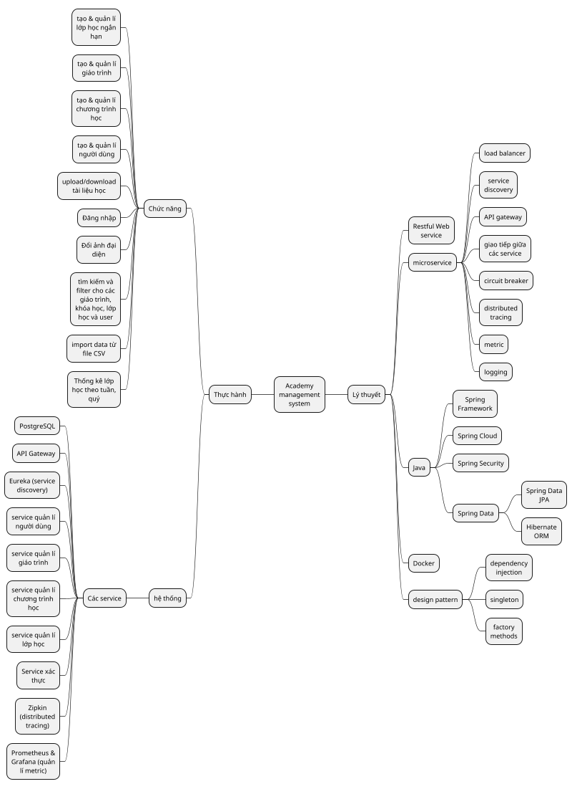

# Báo cáo đợt 1

Sinh viên: Nguyễn Tân Thiên N18DCCN214

Đề tài: Hệ thống Learning Management System

## Planning

### Tuần 1: 24/6 - 30/6

- Xác định phạm vi, mục tiêu và đối tượng sử dụng của ứng dụng.
- Tiến hành nghiên cứu nghiệp vụ quản lý learning management system.
- Xác định các tính năng và chức năng chính.
- Tạo kế hoạch dự án chi tiết, bao gồm các mốc quan trọng và sản phẩm bàn giao.

### Tuần 2: 1/7 - 7/7

- Phát triển ý tưởng thiết kế UI và hoàn thiện giao diện cho ứng dụng.
- Thiết kế CSDL

### Tuần 3: 8/7 - 15/7

- Thiết lập môi trường development
- Triển khai các chức năng cốt lõi của ứng dụng
- Tích hợp các dịch vụ phụ trợ và API cần thiết
- Triển khai xác thực người dùng
- Tích hợp giao diện và backend

### Tuần 4: 16/7 - 21/7

- Tiến hành test và fix bug cho ứng dụng
- Phân tích từ người dùng để cải thiện khả năng sử dụng và hiệu suất của ứng dụng

### Tuần 5: 22/7 - 28/7 và Tuần 6 29/7 - 4/8

- Hoàn thiện phát triển các chức năng
- Tiến hành vòng kiểm tra và sửa lỗi cuối cùng
- Viết cuốn báo cáo
- Chuẩn bị bài thuyết trình giới thiệu các tính năng, quá trình phát triển và thành tựu của ứng dụng
- Gửi ứng dụng đã hoàn thành và tài liệu đi kèm

## Mindmap

## UI/UX

- màn hình đăng nhập

- màn hình xem/chỉnh sửa thông tin người dùng

- màn hình quản lí danh sách người dùng

- màn hình quản lí tạo/chỉnh sửa thông tin người dùng

- màn hình danh sách giáo trình

- màn hình thông tin giáo trình

- màn hình tạo giáo trình

- màn hình danh sách phương thức giảng dạy

- màn hình tạo/chỉnh sửa phương thức giảng dạy

- màn hình danh sách chương trình học

- màn hình danh sách lớp học

- màn hình thông tin lớp học

